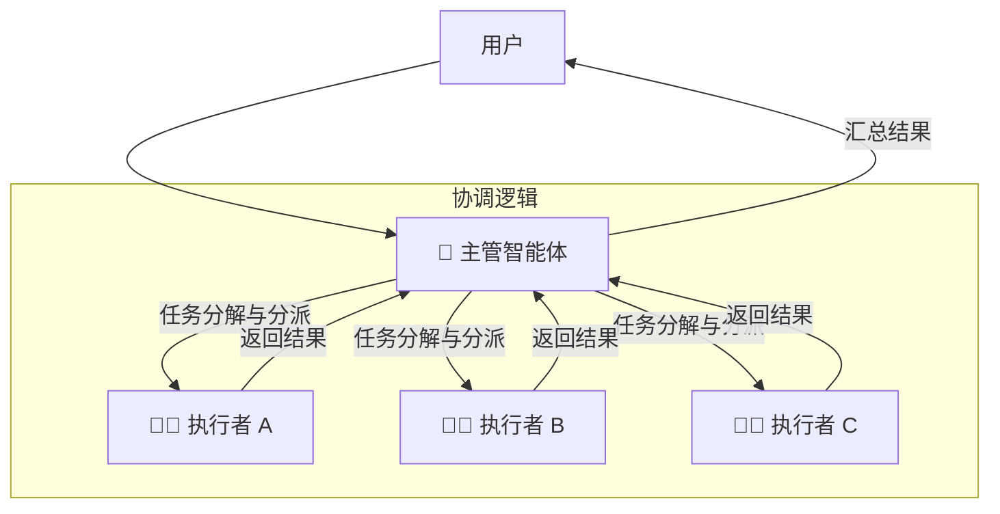
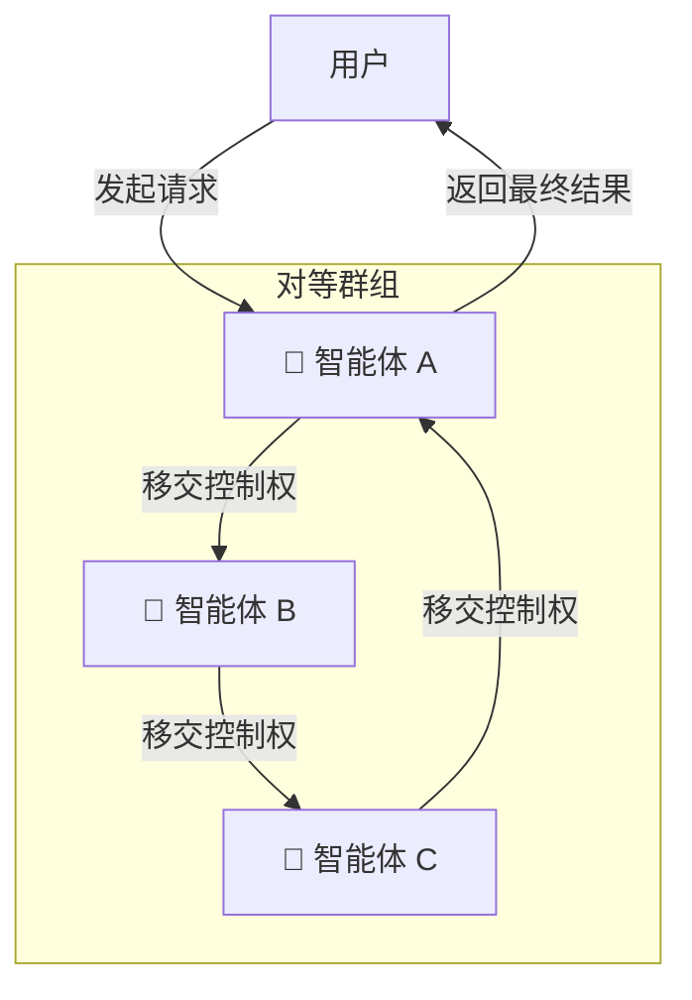
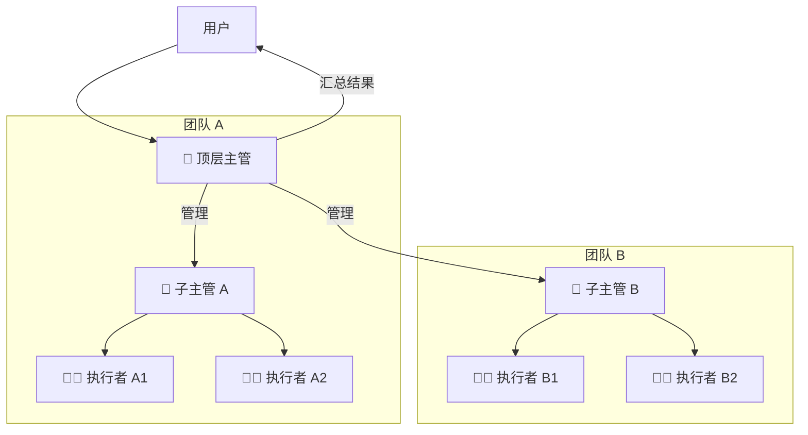
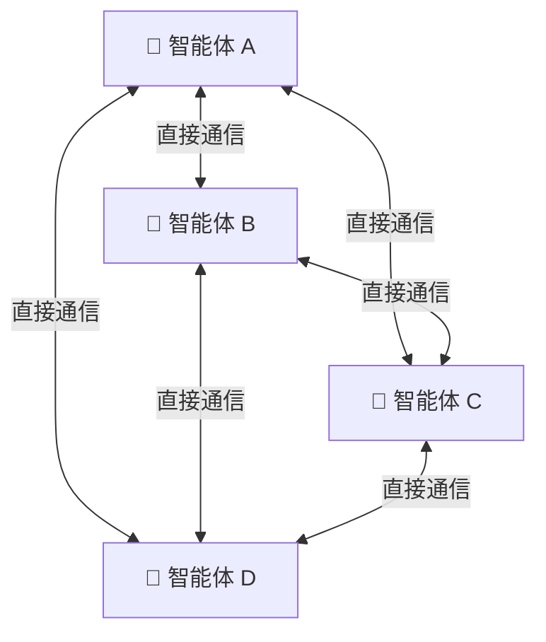

## 一、state状态

### 1.1 定义状态（State）

LangGraph 支持多种方式来定义状态的结构。

**1. 使用 TypedDict（Python 推荐）**

这是最常用的方法，简单直观。

```python
from typing import List
from typing_extensions import TypedDict
from langchain_core.messages import AnyMessage

class State(TypedDict):
    messages: List[AnyMessage]  # 消息列表
    extra_field: int            # 额外整数字段
```

**2. 使用 Pydantic BaseModel**
提供数据验证功能。

```python
from pydantic import BaseModel
from langchain_core.messages import AnyMessage

class State(BaseModel):
    messages: List[AnyMessage]
    extra_field: int
```

**3. 使用 `Annotation.Root`（TypeScript / JavaScript）**

在 JS/TS 中，使用 `Annotation.Root` 来定义状态，并可以内联指定 Reducer。

```typescript
import { Annotation } from "@langchain/langgraph";

// 1. 简单状态：无 reducer，默认覆盖
const SimpleState = Annotation.Root({
    currentOutput: Annotation<string>,
});

// 2. 带 reducer 的状态
const MessagesState = Annotation.Root({
    messages: Annotation<BaseMessage[]>({
        reducer: (left, right) => left.concat(right), // 合并数组
        default: () => [],
    }),
});
```


### 1.2 Reducer（归约器）
#### Reducer 的用法
**Reducer（归约器）是 LangGraph 中控制状态如何更新的核心函数**。简单来说，当一个节点（Node）执行完成后返回更新数据时，Reducer 决定了这份新数据**如何与状态（State）中的现有数据融合**。

其数学表达为：

```
new_state = reducer(current_state, update_value)
```

Reducer 接收两个参数：
- **当前状态值**（current state）
- **节点返回的更新值**（update value）

然后返回合并后的新状态。

**为什么需要 Reducer？** 默认情况下，LangGraph 对状态字段采用**直接覆盖**策略。但在实际场景中，我们往往需要更复杂的更新逻辑——比如将新消息追加到对话历史末尾，而不是覆盖掉之前的消息。Reducer 正是为此而生。

**使用 `Annotated` 类型定义 Reducer（Python）**
在 Python 中，通过 `typing.Annotated` 将 Reducer 函数与状态字段绑定：

```python
from typing import Annotated, TypedDict
from operator import add

class State(TypedDict):
    # 使用 operator.add 作为 reducer：每次更新时做累加
    counter: Annotated[int, add]
    
    # 没有标注 reducer 的字段，默认使用覆盖策略
    name: str
```

---

#### Reducer 类型与示例

**（1）默认 Reducer：覆盖更新**

当状态字段**没有**指定 Reducer 时，默认行为是**直接覆盖**。

```python
from typing import TypedDict
from langgraph.graph import StateGraph, START, END

class State(TypedDict):
    counter: int

def node_a(state: State):
    return {"counter": state["counter"] + 1}

def node_b(state: State):
    return {"counter": state["counter"] * 2}

builder = StateGraph(State)
builder.add_node("node_a", node_a)
builder.add_node("node_b", node_b)
builder.add_edge(START, "node_a")
builder.add_edge("node_a", "node_b")
builder.add_edge("node_b", END)

graph = builder.compile()
result = graph.invoke({"counter": 5})
print(result)  # 输出: {'counter': 12}
# node_a 返回 counter=6，node_b 返回 counter=12，后者覆盖前者
```

**（2）. `operator.add`：数值累加**

适用于计数器、分数聚合、资源统计等场景。

```python
from typing import Annotated, TypedDict
from operator import add
from langgraph.graph import StateGraph, START, END

class State(TypedDict):
    total: Annotated[int, add]  # 累加器

def node_a(state: State):
    return {"total": 10}

def node_b(state: State):
    return {"total": 5}

builder = StateGraph(State)
builder.add_node("node_a", node_a)
builder.add_node("node_b", node_b)
builder.add_edge(START, "node_a")
builder.add_edge("node_a", "node_b")
builder.add_edge("node_b", END)

graph = builder.compile()
result = graph.invoke({"total": 0})
print(result)  # 输出: {'total': 15}  (0 + 10 + 5)
```

**（3）. `add_messages`：消息列表追加**

这是 LangGraph 内置的**消息专用 Reducer**，专门用于对话系统。它会将新消息追加到消息列表末尾，并支持消息的去重、替换和删除。

```python
from typing import Annotated, TypedDict
from langgraph.graph import StateGraph, START, END, add_messages
from langchain_core.messages import AIMessage, HumanMessage

class State(TypedDict):
    messages: Annotated[list, add_messages]

def chatbot(state: State):
    # 模拟 LLM 回复
    return {"messages": [AIMessage(content="你好！有什么我可以帮你的？")]}

builder = StateGraph(State)
builder.add_node("chatbot", chatbot)
builder.add_edge(START, "chatbot")
builder.add_edge("chatbot", END)

graph = builder.compile()
result = graph.invoke({
    "messages": [HumanMessage(content="你好")]
})
print(result["messages"])
# 输出: [HumanMessage(content="你好"), AIMessage(content="你好！有什么我可以帮你的？")]
# 新消息被追加，而不是覆盖
```

**（4）. 自定义 Reducer**

当内置 Reducer 无法满足需求时，可以编写自定义逻辑。

```python
from typing import Annotated, TypedDict

def merge_list_reducer(current: list, update: list | None) -> list:
    """合并两个列表，去重并保持顺序"""
    if update is None:
        return current
    # 合并并去重（保持原有顺序）
    seen = set(current)
    result = current.copy()
    for item in update:
        if item not in seen:
            result.append(item)
            seen.add(item)
    return result

class State(TypedDict):
    items: Annotated[list, merge_list_reducer]

# 使用方式与前述相同
```

---

**为什么 Reducer 在并行执行中至关重要？**

当图中有**多个节点并行执行**（如 Fan-out）并同时更新**同一个状态字段**时，如果没有 Reducer，LangGraph 无法确定如何合并这些并发更新，会抛出 `INVALID_CONCURRENT_GRAPH_UPDATE` 错误。
**Reducer 解决了这个问题**——它定义了明确的合并逻辑，让 LangGraph 知道如何将多个并行节点的输出安全地合并到同一状态字段中。

---

**总结**

| Reducer 类型 | 行为 | 适用场景 |
|---|---|---|
| **默认（无 Reducer）** | 直接覆盖 | 独立计算结果、配置更新 |
| **`operator.add`** | 数值累加 | 计数器、分数聚合 |
| **`add_messages`** | 消息追加 | 对话历史、聊天系统 |
| **自定义 Reducer** | 自定义逻辑 | 复杂合并需求、去重、条件更新 |

**核心要点**：
1. Reducer 决定了状态**如何更新**，而非**是否更新**
2. 通过 `Annotated`（Python）或 `Annotation`（JS）将 Reducer 与字段绑定
3. 并行执行时必须为共享字段定义 Reducer，避免并发冲突

### 1.3 状态相关方法与参数

| 方法/属性 | 描述 | 示例 |
| :--- | :--- | :--- |
| **`StateGraph(state_schema)`** | 构建图时传入状态定义（类或 `Annotation.Root`）。 | `builder = StateGraph(State)` |
| **`.compile()`** | 编译图，使其可执行。可传入 `checkpointer` 等参数以启用持久化。 | `graph = builder.compile(checkpointer=memory)` |
| **`.invoke(input_state)`** | 同步执行图，输入初始状态，返回最终状态。 | `result = graph.invoke({"messages": []})` |
| **`.stream(input_state)`** | 流式执行，可以逐步骤获取状态更新（`updates`）或完整状态（`values`）。 | `for update in graph.stream(...): print(update)` |
| **`.get_state(config)`** | 获取某个配置（如线程ID）下的当前状态，用于持久化和检查点。 | `current = graph.get_state({"configurable": {"thread_id": "1"}})` |
| **`.update_state(config, values)`** | 手动更新指定配置下的状态。 | `graph.update_state(config, {"messages": [...]})` |

## 二、 Node节点

### 2.1 节点的定义方式

在 LangGraph 中，**节点（Node）** 是图的基本执行单元，本质上是**接收当前状态（State）并返回更新后状态的 Python/TypeScript 函数**。每个节点负责完成一个特定的任务，例如调用 LLM、执行工具调用或进行条件判断。

> 核心思想：**节点完成工作，边（Edge）指示下一步该做什么**。


最简单的节点就是一个普通函数：

```python
from typing_extensions import TypedDict

class State(TypedDict):
    x: int

def my_node(state: State) -> dict:
    # 读取状态，执行逻辑，返回更新
    return {"x": state["x"] + 1}
```

节点的**第一个参数始终是当前的 State**，返回值是部分状态更新（`Partial<State>`）。

如果需要访问运行时上下文（如 `user_id`、数据库连接等），可以添加第二个参数：

```python
from langchain_core.runnables import RunnableConfig

class Context(TypedDict):
    user_id: str

def node_with_context(state: State, config: RunnableConfig) -> dict:
    user_id = config.configurable.get("user_id")
    # 执行业务逻辑...
    return {"x": state["x"] + 1}
```


### 2.2 `add_node` 方法详解

将节点添加到图中使用 `add_node` 方法：

**Python 语法**

```python
builder.add_node(
    node,           # 节点名称（str）或节点函数本身
    action,         # 当 node 为字符串时，指定实际的节点函数
    *,
    defer=False,    # 是否延迟执行
    metadata=None,  # 元数据信息
    retry_policy=None,  # 重试策略
    cache_policy=None,   # 缓存策略
    timeout=None,        # 超时设置
)
```

**关键参数说明**

| 参数 | 类型 | 说明 |
|------|------|------|
| `node` | `str` 或 `StateNode` | 节点名称或节点函数 |
| `action` | `StateNode` | 当 `node` 为字符串时，指定实际执行的函数 |
| `defer` | `bool` | 是否延迟执行该节点 |
| `retry_policy` | `RetryPolicy` | 节点失败时的重试策略 |
| `timeout` | `float` / `timedelta` | 节点执行超时时间 |

**使用示例**

```python
from langgraph.graph import StateGraph, START

builder = StateGraph(State)

# 方式一：直接传入函数（自动使用函数名作为节点名）
builder.add_node(my_node)

# 方式二：自定义节点名称
builder.add_node("my_fair_node", my_node)

# 方式三：使用匿名函数
builder.add_node("lambda_node", lambda state: {"x": state["x"] * 2})

# 连接节点
builder.add_edge(START, "my_fair_node")
graph = builder.compile()

result = graph.invoke({"x": 1})  # {'x': 2}
```

---

### 2.3 节点的高级用法

**1. 使用 `Command` 进行路由控制**
节点可以返回 `Command` 对象，同时完成状态更新和路由跳转：

```python
from langgraph.graph import Command

def router_node(state: State) -> Command:
    if state.get("needs_tool"):
        return Command(
            goto="tool_node",           # 跳转到工具节点
            update={"step": state["step"] + 1}
        )
    return Command(goto="agent_node")   # 跳转到智能体节点
```

**2. 使用 `ToolNode` 预置节点**

LangGraph 提供了预置的 `ToolNode`，用于执行工具调用：

```python
from langgraph.prebuilt import ToolNode

# 定义工具列表
tools = [search_tool, calculator_tool]
tool_node = ToolNode(tools)

builder.add_node("tools", tool_node)
```


### 2.4 完整示例
**构建一个简单聊天机器人**
```python
from typing_extensions import TypedDict
from langgraph.graph import StateGraph, START, END
from langchain_core.messages import HumanMessage, AIMessage

# 1. 定义状态
class State(TypedDict):
    messages: list
    step: int

# 2. 定义节点函数
def chat_node(state: State) -> dict:
    # 模拟 LLM 响应
    last_msg = state["messages"][-1]["content"] if state["messages"] else ""
    response = f"你说的是：{last_msg}，我收到了！"
    return {
        "messages": [{"role": "assistant", "content": response}],
        "step": state.get("step", 0) + 1
    }

def check_node(state: State) -> dict:
    # 检查是否应该结束
    if state.get("step", 0) >= 3:
        return {"messages": [{"role": "system", "content": "对话结束"}]}
    return {}

# 3. 构建图
builder = StateGraph(State)
builder.add_node("chat", chat_node)
builder.add_node("check", check_node)

builder.add_edge(START, "chat")
builder.add_edge("chat", "check")
builder.add_edge("check", END)

# 4. 编译并执行
graph = builder.compile()
result = graph.invoke({
    "messages": [{"role": "user", "content": "你好！"}],
    "step": 0
})
print(result)
```

## 三、边（Edges）

在 LangGraph 中，**边（Edges）** 是连接**节点（Nodes）**、定义程序执行流向的核心组件。简单来说，`Nodes` 负责“做什么”，而 `Edges` 负责“接下来做什么”。

### 3.1 核心方法

在 `StateGraph` 构建器中，主要通过两个方法来定义边：

*   **`add_edge(source, target)`**: 定义一条**普通边（Normal Edge）**，表示从 `source` 节点执行完后，**无条件地**、**总是**去执行 `target` 节点。
*   **`add_conditional_edges(source, path, path_map=None)`**: 定义一条**条件边（Conditional Edge）**，它会在 `source` 节点执行完后，**根据当前状态（State）** 动态决定下一个要执行的节点。

LangGraph 预置了两个特殊节点常量：
*   `START`: 图的入口。
*   `END`: 图的终点，执行到此处即终止。

**1. `add_edge`**

此方法用于建立确定性的执行路径。

*   **参数**:
    *   `source` (str): 起始节点的名称。
    *   `target` (str): 目标节点的名称。
*   **行为**:
    *   从 `START` 连接到第一个节点，定义入口。
    *   连接到 `END` 表示流程结束。
    *   如果一个节点有多个出边（例如 `add_edge("A", "B")` 和 `add_edge("A", "C")`），则 `B` 和 `C` 会在同一个**超级步（Superstep）** 中**并行执行**。

**2. `add_conditional_edges`**

此方法用于实现动态路由。

*   **参数**:
    *   `source` (str): 起始节点的名称。
    *   `path` (Callable): **路由函数（Routing Function）**。它接收当前 `State` 作为参数，并返回一个字符串（或字符串列表），用于指示下一个节点的名称。
    *   `path_map` (dict, optional): **路径映射**。一个可选字典，用于将 `path` 函数的返回值映射到实际的节点名称。这在返回值是符号（如 "continue", "exit"）而非确切节点名时很有用。
*   **行为**:
    *   `path` 函数可以返回单个节点名（分支）或一个节点名列表（扇出，Fan-out）。
    *   若提供了 `path_map`，LangGraph 会根据映射关系找到目标节点。

### 3.2 代码示例

**示例 1：普通边 (固定流转)**
这个例子展示了如何使用 `add_edge` 构建一个简单的顺序工作流。

```python
from langgraph.graph import StateGraph, END

# 定义节点函数
def step_a(state):
    state["result"] = "A完成"
    return state

def step_b(state):
    state["result"] += " -> B完成"
    return state

def step_c(state):
    state["result"] += " -> C完成"
    return state

# 1. 构建图
builder = StateGraph(dict)

# 2. 添加节点
builder.add_node("step_a", step_a)
builder.add_node("step_b", step_b)
builder.add_node("step_c", step_c)

# 3. 添加边 (固定流转)
builder.add_edge(START, "step_a")  # 从 START 开始
builder.add_edge("step_a", "step_b") # A 完成后执行 B
builder.add_edge("step_b", "step_c") # B 完成后执行 C
builder.add_edge("step_c", END)      # C 完成后结束

# 4. 编译并运行
graph = builder.compile()
result = graph.invoke({"result": ""})
print(result) # 输出: {'result': 'A完成 -> B完成 -> C完成'}
```

**示例 2：条件边 (动态路由)**

这个例子展示了如何根据用户输入，使用 `add_conditional_edges` 动态路由到不同节点。

```python
from langgraph.graph import StateGraph, END
from typing import Literal

# 1. 定义 State
class State(dict):
    query: str
    response: str

# 2. 定义节点函数
def classifier(state: State):
    return state # 此节点仅用于路由判断，直接返回 state

def price_handler(state: State):
    state["response"] = "正在查询价格..."
    return state

def after_sales_handler(state: State):
    state["response"] = "转接售后专员..."
    return state

def general_handler(state: State):
    state["response"] = "这是通用回答..."
    return state

# 3. 定义路由函数
def route_query(state: State) -> Literal["price", "after_sales", "general"]:
    query = state.get("query", "")
    if "价格" in query or "多少钱" in query:
        return "price"
    elif "售后" in query or "维修" in query:
        return "after_sales"
    else:
        return "general"

# 4. 构建图
builder = StateGraph(State)
builder.add_node("classifier", classifier)
builder.add_node("price", price_handler)
builder.add_node("after_sales", after_sales_handler)
builder.add_node("general", general_handler)

# 5. 设置入口并添加条件边
builder.set_entry_point("classifier") # 从 classifier 开始
builder.add_conditional_edges(
    "classifier",            # 起始节点
    route_query,             # 路由函数
    {                        # 路径映射 (可选)
        "price": "price",
        "after_sales": "after_sales",
        "general": "general"
    }
)
# 为三个业务节点添加指向 END 的固定边
builder.add_edge("price", END)
builder.add_edge("after_sales", END)
builder.add_edge("general", END)

# 6. 编译并运行
graph = builder.compile()
result = graph.invoke({"query": "我想问一下价格"})
print(result) # 输出: {'query': '我想问一下价格', 'response': '正在查询价格...'}
```

**示例 3：条件边 + `path_map` (映射路由)**

`path_map` 在你希望路由函数的返回值更具描述性，而非直接等于节点名时非常有用。

```python
from langgraph.graph import StateGraph, END
import random

# 定义节点 (node_1, node_2, node_3 略, 与示例1类似)
# ...

# 定义路由函数，返回描述性字符串
def decide_mood(state) -> str:
    if random.random() < 0.5:
        return "happy"  # 返回描述性标签
    else:
        return "sad"

builder = StateGraph(State)
# ... 添加 node_1, node_2, node_3 ...

# 使用 path_map 将描述性标签映射到实际节点名
builder.add_conditional_edges(
    "node_1",             # 起始节点
    decide_mood,          # 路由函数
    {                     # path_map
        "happy": "node_2",
        "sad": "node_3"
    }
)
```


## 四、控制流与并发

### 4.1 控制流

控制流决定了“下一步做什么”，主要通过以下几种方式实现：

*   **1. 顺序执行 (Sequential Execution)**
    这是最基本的流程，通过**普通边（Normal Edge）** `add_edge` 连接节点，确保它们按固定顺序执行。
    ```python
    from langgraph.graph import StateGraph, START, END

    builder = StateGraph(State)
    builder.add_node("node_a", my_node_a)
    builder.add_node("node_b", my_node_b)
    builder.add_edge(START, "node_a") # 从 START 到 node_a
    builder.add_edge("node_a", "node_b") # node_a 执行完后到 node_b
    builder.add_edge("node_b", END) # node_b 执行完后结束
    graph = builder.compile()
    ```

*   **2. 条件分支 (Conditional Branching)**
    允许根据当前状态动态选择下一个要执行的节点。通过**条件边（Conditional Edge）** `add_conditional_edges` 实现，路由函数返回一个表示下一个节点名称的字符串。
    ```python
    from langgraph.graph import StateGraph, START, END

    def routing_function(state: State) -> str:
        if state["user_input"] == "help":
            return "help_node"
        else:
            return "process_node"

    builder = StateGraph(State)
    builder.add_node("help_node", help_func)
    builder.add_node("process_node", process_func)
    builder.add_conditional_edges(START, routing_function) # 条件路由
    # 可以指定路由映射
    # builder.add_conditional_edges(START, routing_function, {"help_node": "help_node", "process_node": "process_node"})
    graph = builder.compile()
    ```

*   **3. 循环与递归 (Cycles / Recursion)**
    LangGraph 支持在图中创建循环，非常适合实现 ReAct 代理这类需要“思考-行动-观察”迭代的场景。循环可以通过在节点间添加一条或多条边，形成闭环来实现。
    ```python
    # 接上例，如果 process_node 处理完后，根据状态决定是结束还是回到某个节点
    def after_process_routing(state: State) -> str:
        if state["task_complete"]:
            return END
        else:
            return "agent_node" # 回到之前的节点，形成循环

    builder.add_conditional_edges("process_node", after_process_routing)
    ```

*   **4. 高级控制：`Command` API**
    `Command` 对象允许一个节点在返回时，**同时更新状态（State）并指定下一个要前往的节点**。这可以替代条件边，实现更动态、更集中的路由控制。
    ```python
    from langgraph.types import Command

    def smart_node(state: State):
        if state["urgent"]:
            # 更新状态并直接跳转到 fast_track 节点
            return Command(update={"priority": "high"}, goto="fast_track")
        else:
            return Command(update={"priority": "low"}, goto="normal_track")
    ```
    *   **参数**：
        *   `update` (dict): 要合并到全局状态中的数据。
        *   `goto` (str): 下一个要执行的节点的名称。


### 4.2 Command

`Command` 允许一个节点在返回时，**同时完成两件事**：更新状态 (`update`) 和指定下一个要执行的节点 (`goto`)。这使得流程控制逻辑从“边”转移到了“节点”内部，更加灵活和直观。

**核心参数**
*   **`update`** (`dict`): 要更新的状态数据，和普通节点返回的更新一样。
*   **`goto`** (`str` 或 `List[str]`): 指定下一个要执行的节点名称。
*   **`graph`** (`Command.PARENT`): 在子图中使用时，可通过此参数跳转到父图中的节点。
*   **`resume`**: 与 `interrupt()` 配合使用，用于恢复被暂停的图。

**基本用法示例**
假设我们有一个节点，需要根据内部逻辑决定去往 `node_b` 还是 `node_c`。

```python
from langgraph.graph import StateGraph, END
from langgraph.types import Command
from typing import Literal

# 定义状态
class State(dict):
    foo: str

# 定义节点，返回类型注解指明了可能跳转的目标节点
def node_a(state: State) -> Command[Literal["node_b", "node_c"]]:
    # 模拟一个动态决策
    import random
    goto = "node_b" if random.random() > 0.5 else "node_c"
    
    # 同时更新状态并指定下一站
    return Command(
        update={"foo": "a"},  # 状态更新
        goto=goto             # 流程控制
    )

def node_b(state: State):
    print("执行 B")
    return {"foo": state.get("foo", "") + "|b"}

def node_c(state: State):
    print("执行 C")
    return {"foo": state.get("foo", "") + "|c"}

# 构建图
builder = StateGraph(State)
builder.add_node("node_a", node_a, ends=["node_b", "node_c"]) # ends参数帮助可视化
builder.add_node("node_b", node_b)
builder.add_node("node_c", node_c)
builder.add_edge("__start__", "node_a")
builder.add_edge("node_b", END)
builder.add_edge("node_c", END)

graph = builder.compile()
# 此时，图中不存在从 node_a 到 node_b 或 node_c 的显式边
# 流程完全由 node_a 返回的 Command 决定
```

**典型应用场景：多智能体交接 (Handoff)**
`Command` 是实现多智能体系统（Multi-agent System）中“交接”的理想工具。一个智能体（节点）在处理完任务后，可以通过 `Command` 直接将控制权“交接”给另一个专门的智能体（节点）。

```python
def agent_router(state):
    # ... 分析用户意图 ...
    if "天气" in state["query"]:
        # 交接给天气智能体，并传递相关信息
        return Command(goto="weather_agent", update={"intent": "weather"})
    else:
        return Command(goto="default_agent")
```

---

### 4.3 Send 动态并行

你是一个项目经理，今天要处理一个任务清单：
```
任务清单 = ["写报告", "做PPT", "发邮件"]
```
你不可能自己一个人干完，所以你**动态**地（根据清单的内容）为**每一个**任务都**招聘**一个员工去执行，而且他们可以**同时开工**。

这里的关键点有三个：

1. **任务数量不确定**：今天是3个，明天可能是10个，没法在代码里写死。
2. **每个任务处理的数据不同**：一个员工处理“写报告”，一个处理“做PPT”。
3. **并行执行**：大家同时干，效率最高。

如果用普通的图（边）来做，你只能画死 `A -> B -> C`，无法应对这种“清单长度会变化”的情况。

**`Send` 就是用来做这件事的**：它让你在图的运行过程中，**根据当前状态里的数据，动态地、并行地产生任意数量的新任务**。

---

**🧱 拆解 `Send` 的两个参数**
`Send` 本身非常简单，就两个参数：

| 参数 | 含义 | 生活化类比 |
| :--- | :--- | :--- |
| **`node`** | 你要把任务派给**哪个节点（员工）** 去做。 | “这个任务交给哪位同事？” |
| **`arg`** | 你要传给那个节点的**专属数据**。 | “交给他的具体工作内容和资料是什么？” |

注意：`arg` 里的数据结构，**可以和你主图的状态（State）结构不同**。比如主图状态是 `{"任务清单": [...]}`，但你用 `Send` 传过去的是 `{"单个任务": "写报告"}`，这样每个员工只关心自己的那一小块工作，更清晰。

---

**📖 一个让你彻底明白的例子**

这次我们做一个**“批量文件处理”**的例子，逻辑简单直接。

**场景:**
主图接收到一个文件列表 `["a.txt", "b.txt", "c.txt"]`，我们要为**每一个文件**启动一个独立的 `processor` 节点来处理它。

```python
from langgraph.graph import StateGraph, END
from langgraph.types import Send
from typing import List, Annotated
import operator

# 1. 定义主图的状态
# files: 待处理的文件列表
# results: 所有处理结果的汇总（使用 operator.add 自动累加）
class OverallState(dict):
    files: List[str]
    results: Annotated[List[str], operator.add]

# 2. 定义“分配任务”的函数（这是一个条件边的路由函数）
def assign_worker(state: OverallState):
    """
    这个函数根据主状态里的 files 列表，动态产生一堆 Send 任务。
    """
    # 关键点：遍历列表，为每一个文件创建一个 Send 对象
    send_list = []
    for file_name in state["files"]:
        # Send(node=目标节点名, arg=传给该节点的状态)
        # 注意：arg 里的结构是 {"file": file_name}，与主状态 OverallState 不同
        send_list.append(
            Send(
                node="processor",          # 所有任务都发给 processor 这个节点
                arg={"file": file_name}    # 但每个任务携带的数据不同
            )
        )
    return send_list  # 返回 Send 对象列表

# 3. 定义“工作节点”的函数
def processor(state: dict):
    """
    这个节点接收来自 Send 的 arg 数据，只处理一个文件。
    state 在这里是 {"file": "a.txt"} 这样的结构。
    """
    file = state["file"]
    # 模拟处理，生成一个结果
    result = f"已处理: {file}"
    # 返回的结果会被累加到主状态的 results 字段中（因为用了 operator.add）
    return {"results": [result]}

# 4. 构建图
builder = StateGraph(OverallState)

# 添加节点
builder.add_node("processor", processor)  # 工作节点

# 关键：从 START 开始，添加一条条件边
# 这条边的路由函数是 assign_worker，它会动态返回一堆 Send
builder.add_conditional_edges(START, assign_worker)

# 所有 processor 节点执行完毕后，都指向 END
builder.add_edge("processor", END)

# 5. 编译并运行
graph = builder.compile()

# 输入一个有 3 个文件的列表
result = graph.invoke({"files": ["a.txt", "b.txt", "c.txt"], "results": []})
print(result)
```

**运行结果**
```text
{
    'files': ['a.txt', 'b.txt', 'c.txt'],
    'results': ['已处理: a.txt', '已处理: b.txt', '已处理: c.txt']
}
```

---

**❓ 为什么这里必须用 `Send`？不用行不行？**
你可能会想：“我能不能不用 `Send`，而是直接在 `assign_worker` 节点里写一个循环，依次调用 `processor`？”

**不行。** 原因在于：

*   如果用普通循环，那是**串行**的，一个一个处理，很慢。
*   `Send` 的强大之处在于，它告诉 LangGraph：“这些任务都是**相互独立**的，请把它们**并行执行**。” LangGraph 会充分利用资源，同时启动多个 `processor` 实例来干活。

---

## 五、图构建器(StateGraph)
### 5.1 介绍
`StateGraph` 是 LangGraph 的核心构建器，用于创建**有状态**、**多步骤**的工作流图。它的核心思想是，图中的各个**节点（Node）** 通过读写一个共享的**状态（State）** 对象来进行通信。

`StateGraph` 本身是一个**构建器（Builder）**，不能直接执行。你需要先通过 `add_node`、`add_edge` 等方法定义图的结构，最后调用 `.compile()` 方法将其编译成一个可执行的图。

**构造函数**

创建 `StateGraph` 实例时，最重要的参数是 `state_schema`，它定义了 State 的结构。

**Python**
```python
from langgraph.graph import StateGraph
from typing import TypedDict

# 1. 使用 TypedDict 定义状态结构
class MyState(TypedDict):
    counter: int
    messages: list

# 2. 创建 StateGraph 实例
builder = StateGraph(state_schema=MyState)
```

**构造函数参数详解 (Python版)**

| 参数 | 类型 | 描述 |
| :--- | :--- | :--- |
| **`state_schema`** | `Type[StateT]` | **(必填)** 定义整个图的状态结构。可以是 `TypedDict`、Pydantic `BaseModel` 或 `dataclass`。 |
| `context_schema` | `Type[ContextT]` | **可选**。定义运行时上下文（如 `user_id`, `db_conn` 等不变数据）的结构。 |
| `input_schema` | `Type[InputT]` | **可选**。覆盖图的输入模式，用于校验或类型提示。 |
| `output_schema` | `Type[OutputT]` | **可选**。覆盖图的输出模式，用于校验或类型提示。 |

**主要方法(StateGraph)*
`add_node`：添加节点
`add_edge`：添加普通边
`add_conditional_edges`：添加条件边

### 5.2 compile（编译图）

- **作用**：将构建好的 `StateGraph` 编译成一个可执行的图。
- **返回值**：一个 `CompiledStateGraph` 对象。

**示例**:
```python
# 编译图，可在此处配置检查点等
app = builder.compile()
```

**编译后的执行**

编译后得到的 `CompiledStateGraph` 对象支持多种执行方法：

| 方法 | 描述 |
| :--- | :--- |
| **`.invoke(input)`** | 同步执行整个图，并返回最终状态。 |
| **`.ainvoke(input)`** | 异步执行 `invoke`。 |
| **`.stream(input)`** | 同步流式执行，逐步返回状态更新。 |
| **`.astream(input)`** | 异步执行 `stream`。 |

**执行示例 (Python)**:
```python
# 调用图，传入初始状态
final_state = app.invoke({"counter": 0, "messages": []})
print(final_state) # 输出: {'counter': 1, 'messages': []}
```

### 5.3 完整代码示例

下面是一个完整的 Python 示例，展示了一个包含条件循环的计数器图。

```python
from typing import TypedDict
from langgraph.graph import StateGraph, START, END

# 1. 定义状态
class CounterState(TypedDict):
    counter: int
    max_count: int

# 2. 定义节点
def increment(state: CounterState) -> dict:
    """计数器加1"""
    return {"counter": state["counter"] + 1}

def should_continue(state: CounterState) -> str:
    """判断是否继续增加"""
    if state["counter"] < state["max_count"]:
        return "continue"
    else:
        return "end"

# 3. 构建图
builder = StateGraph(state_schema=CounterState)

# 添加节点
builder.add_node("increment", increment)

# 添加边：从 START 到 increment
builder.add_edge(START, "increment")

# 添加条件边：从 increment 根据 should_continue 的结果跳转
builder.add_conditional_edges(
    "increment",
    should_continue,
    {
        "continue": "increment",  # 形成循环
        "end": END
    }
)

# 4. 编译图
app = builder.compile()

# 5. 执行图
initial_state = {"counter": 0, "max_count": 3}
final_state = app.invoke(initial_state)
print(final_state)  # 输出: {'counter': 3, 'max_count': 3}
```

## 六、人机交互
LangGraph的人机交互（Human-in-the-Loop, HIL）核心是**中断（Interrupt）** 机制。它允许你在图执行的特定节点暂停，等待外部输入（如人工审批、数据修正等），然后从中断点精确恢复。

实现这一机制，主要依赖两个核心API：`interrupt()` 和 `Command`，并需要**检查点（Checkpointer）** 的支持来持久化状态。

### 6.1 interrupt 中断
`interrupt()` 是触发暂停的关键。当图执行到它时，会暂停并向外返回一个值（payload）。
```python
# 创建包含 interrupt 的节点
def human_feedback_node(state: State):
    # 暂停执行，并向外部请求信息
    answer = interrupt("请问您的年龄是？")  # 这里 "请问您的年龄是？" 是会传给前端的 payload
    # 当恢复时，answer 会接收到 Command(resume=...) 传入的值
    print(f">>> 从interrupt接收到: {answer}")
    # 更新状态
    return {"human_value": answer}
```
*   **定义与用法**：在图的节点函数内部调用 `interrupt(value)`。
*   **参数**：
    *   `value` (Any): 任意JSON可序列化的值。这是你希望传递给外部调用者（如前端界面或API客户端）的信息，用于说明暂停原因或请求特定数据。例如，可以传递 `"请审批此操作"` 或 `{"text_to_revise": "原始文本"}` 这样的字典。
*   **返回值**：当图被恢复时，`interrupt()` 函数会**返回**从外部传入的值。这个返回值可以在节点内被使用，例如更新状态。
*   **重要特性**：
    *   **节点会重执行**：恢复后，包含 `interrupt()` 的**整个节点会从头开始重新执行**。因此，最佳实践是将 `interrupt()` 放在节点的开头或一个独立的专用节点中。
    *   **多次中断**：一个节点内可以有多次 `interrupt()` 调用。恢复时，传入的值会按调用顺序依次匹配。
 


**两种中断方式：静态 vs 动态**

**静态中断点 (Breakpoints)**：在编译图时通过 `interrupt_before` 或 `interrupt_after` 参数指定在特定节点**之前**或**之后**暂停。这种方式简单直接，适合在固定位置插入人工审核。
```python
app = builder.compile(
    checkpointer=InMemorySaver(),
    interrupt_before=["node_a"],
    interrupt_after=["node_b"],
)
```

*   **动态中断 (Dynamic Interrupts)**：在节点代码内部通过调用 `interrupt()` 函数实现。这种方式更灵活，可以根据当前的图状态（`state`）有条件地决定是否暂停。
```python
def process_node(state: State):
    age = interrupt("请问您的年龄是？")
    return {"user_age": age}
```

### 6.2 Command 恢复执行
`Command` 是用来恢复被中断图执行的指令。

*   **定义与用法**：在第二次调用图（`invoke`, `stream`等）时，通过 `Command(resume=...)` 传入。
*   **关键参数**：
    *   `resume` (Any): 你要传递给中断点的值。这个值会成为 `interrupt()` 函数的返回值。
*   **恢复流程**：调用 `graph.stream(Command(resume="用户输入的内容"), config)`。

```python
user_input = "25"  # 模拟从命令行或UI获取的输入
for chunk in graph.stream(Command(resume=user_input), config):
    print(chunk)
# 最终状态中 human_value 会被更新为 "25"
```

### 6.3 实现步骤与示例

一个完整的人机交互流程通常包含以下步骤：

1.  **定义状态**：使用 `TypedDict` 定义图的状态。
2.  **创建节点**：在需要人机交互的节点函数中调用 `interrupt()`。
3.  **构建图**：使用 `StateGraph` 构建图，添加节点和边。
4.  **编译并配置检查点**：编译图时传入 `checkpointer` 实例，并配置一个唯一的 `thread_id`。
5.  **首次执行（触发中断）**：运行图直到遇到 `interrupt()`，此时图会暂停并返回中断信息。
6.  **获取人工输入**：从返回的中断信息中解析出需要展示给用户的内容，并获取用户的输入。
7.  **恢复执行**：使用 `Command(resume=用户输入)` 再次调用图，从中断点继续执行。

**示例：请求用户输入年龄**
```python
import uuid
from typing import Optional, TypedDict
from langgraph.checkpoint.memory import InMemorySaver
from langgraph.constants import START
from langgraph.graph import StateGraph
from langgraph.types import interrupt, Command

# 1. 定义状态
class State(TypedDict):
    human_value: Optional[str]

# 2. 创建包含 interrupt 的节点
def human_feedback_node(state: State):
    # 暂停执行，并向外部请求信息
    answer = interrupt("请问您的年龄是？")  # 这里 "请问您的年龄是？" 是会传给前端的 payload
    # 当恢复时，answer 会接收到 Command(resume=...) 传入的值
    print(f">>> 从interrupt接收到: {answer}")
    # 更新状态
    return {"human_value": answer}

# 3. 构建图
builder = StateGraph(State)
builder.add_node("human_feedback", human_feedback_node)
builder.add_edge(START, "human_feedback")

# 4. 配置检查点并编译
checkpointer = InMemorySaver()
graph = builder.compile(checkpointer=checkpointer)

# 配置一个唯一的线程ID
config = {"configurable": {"thread_id": uuid.uuid4()}}

# 5. 首次执行（触发中断）
print("--- 首次运行，触发中断 ---")
# 使用 stream 来捕获中断信息
for chunk in graph.stream({}, config):
    print(chunk)  # 输出会包含 __interrupt__ 字段

# 6. 模拟获取人工输入后，恢复执行
print("\n--- 恢复执行 ---")
user_input = "25"  # 模拟从命令行或UI获取的输入
for chunk in graph.stream(Command(resume=user_input), config):
    print(chunk)
# 最终状态中 human_value 会被更新为 "25"
```

**常见设计模式**

LangGraph的人机交互支持多种模式：

| 模式 | 描述 | 实现思路 |
| :--- | :--- | :--- |
| **批准或拒绝 (Approve/Reject)** | 在执行敏感操作（如API调用、发送邮件）前暂停，等待人工审批。 | 在操作节点前调用 `interrupt()`。根据用户返回的“批准”或“拒绝”值，通过条件边路由到不同节点。 |
| **编辑图状态 (Edit State)** | 在关键节点后暂停，让人工审查并修正状态，如纠正AI的中间推理结果。 | 在节点后调用 `interrupt()`，将当前状态作为payload发出。用户修改后，通过 `Command` 将新状态传回并更新。 |
| **获取输入 (Get Input)** | 当AI缺乏关键信息时，主动暂停并向用户提问。 | 在节点内逻辑判断需要信息时调用 `interrupt()`。用户的回答会作为 `interrupt()` 的返回值被节点接收并用于后续处理。 |

**最佳实践与注意事项**

1.  **节点重执行**：牢记 `interrupt()` 所在的节点在恢复时会**重新执行**。因此，应避免在该节点中进行有副作用（如扣费、发送邮件）的操作，或确保这些操作是幂等的。
2.  **使用 `stream`**：在需要人机交互的场景下，推荐使用 `stream` 方法来运行图。它能更好地捕获和展示 `__interrupt__` 信息，而 `invoke` 遇到中断可能会抛出异常。
3.  **Payload设计**：`interrupt()` 的 `value` 参数应设计得清晰明了，最好包含上下文信息，方便前端或API调用者理解需要做什么。
4.  **持久化检查点**：在生产环境中，务必使用支持持久化存储（如Postgres、Redis）的检查点，而不是内存版本，以防止服务重启导致中断状态丢失。

总而言之，LangGraph通过`interrupt`和`Command`这一对精巧的API，配合持久化的检查点机制，为构建安全、可控的AI应用提供了强大而灵活的人机协作能力。


## 七、子图

在LangGraph中，**子图（Subgraph）本质上是一个被当作节点（Node）嵌入到另一个图（父图）中的图**。它的核心价值在于通过模块化设计，将复杂的工作流拆解为一个个独立、可复用的逻辑单元。


### 7.1 不同状态模式

*   **适用场景**：父图和子图的状态完全独立，没有共享的键。这常用于需要为每个Agent维护私有历史记录的多智能体系统。
*   **用法**：你需要定义一个**包装函数（Wrapper Function）** 作为父图的节点。在这个函数内部：
    1.  从父图状态中提取所需数据。
    2.  将其转换为子图所期望的输入状态格式。
    3.  调用 `subgraph.invoke()` 执行子图。
    4.  获取子图的输出结果。
    5.  将结果转换回父图状态的格式，并返回更新。

*   **状态查看**：开启持久化（Checkpointer）后，可通过 `graph.get_state(config, subgraphs=True)` 查看子图的内部状态。
*   **流式输出**：在父图调用 `.stream(..., subgraphs=True)` 时，可以同时获取父图和所有子图的流式输出事件。事件会以 `(命名空间, 数据)` 的元组形式返回，其中`命名空间`标识了事件来自哪个层级的哪个节点。
*   **嵌套子图**：子图内部还可以再包含子图，形成多层嵌套结构，用于处理极其复杂的业务逻辑。
*   **检查点（Checkpoint）**：
    *   通常建议**只为父图配置检查点（Checkpointer）**，以避免状态重复存储。
    *   编译子图时也可以传入 `checkpointer` 参数，但这在需要为子图实现独立的 `interrupt()` 中断逻辑时尤为重要。
    *   如果多个图共享同一个检查点和 `thread_id`，它们的状态可能会被合并。若需隔离，可以为每个图分配独立的 `checkpointer` 实例。

这个例子中，父图状态有 `user_input` 键，子图状态有 `sub_input` 键，两者完全独立。

```python
from typing_extensions import TypedDict
from langgraph.graph import StateGraph, START, END

# 1. 定义不同的状态
class ParentState(TypedDict):
    user_input: str

class SubgraphState(TypedDict):
    sub_input: str

# 2. 定义子图
# 子图节点：处理自己的状态
def subgraph_node(state: SubgraphState):
    return {"sub_input": f"子图处理: {state['sub_input']}"}

subgraph_builder = StateGraph(SubgraphState)
subgraph_builder.add_node("subgraph_node", subgraph_node)
subgraph_builder.add_edge(START, "subgraph_node")
subgraph_builder.add_edge("subgraph_node", END)
subgraph = subgraph_builder.compile()

# 3. 定义父图
def wrapper_node(state: ParentState):
    # 关键点1: 将父状态转换为子状态
    sub_input = {"sub_input": state["user_input"]}
    
    # 关键点2: 调用子图
    sub_output = subgraph.invoke(sub_input)
    
    # 关键点3: 将子图输出转换回父状态
    return {"user_input": sub_output["sub_input"]}

builder = StateGraph(ParentState)
builder.add_node("wrapper_node", wrapper_node) # 添加包装函数作为节点
builder.add_edge(START, "wrapper_node")
builder.add_edge("wrapper_node", END)
graph = builder.compile()

# 4. 执行
initial_state = {"user_input": "你好世界"}
final_state = graph.invoke(initial_state)
print(final_state["user_input"])
# 输出: 子图处理: 你好世界
```


### 7.2 共享状态模式

*   **适用场景**：父图和子图的状态模式（State Schema）有共同的键（Key），例如共享一个 `messages` 列表。
*   **用法**：这是最直接的方式。你只需将编译好的子图实例作为节点，通过父图的 `.add_node()` 方法添加即可。子图可以直接读写父图状态中共享的键。
*   **优点**：代码简洁，无需手动进行状态转换。

#### 单子图

```python
from typing_extensions import TypedDict
from langgraph.graph import StateGraph, START, END

# 1. 定义共享的状态
class SharedState(TypedDict):
    messages: list

# 2. 定义子图
# 子图节点：向共享的 messages 中添加一条消息
def subgraph_node(state: SharedState):
    return {"messages": state["messages"] + ["来自子图的消息"]}

# 构建子图
subgraph_builder = StateGraph(SharedState)
subgraph_builder.add_node("subgraph_node", subgraph_node)
subgraph_builder.add_edge(START, "subgraph_node")
subgraph_builder.add_edge("subgraph_node", END)
# 编译子图
subgraph = subgraph_builder.compile()

# 3. 定义父图
builder = StateGraph(SharedState)

# 关键点：直接将编译好的子图作为节点添加
builder.add_node("subgraph", subgraph) 

# 设置入口和出口
builder.add_edge(START, "subgraph")
builder.add_edge("subgraph", END)

# 编译父图
graph = builder.compile()

# 4. 执行
initial_state = {"messages": ["初始消息"]}
final_state = graph.invoke(initial_state)
print(final_state["messages"])
# 输出: ['初始消息', '来自子图的消息']
```

---
####  多子图


**子图和父图为什么能共享logs属性？**
要让共享正常工作，必须满足以下几点：
1. **键名完全一致**：父图和子图状态中 `logs` 的键名必须一模一样。
2. **类型兼容**：子图读取时，必须能正确解析父图传入的该键的数据类型（例如都是 `list[Logs]`）。
3. **Reducer一致性**：父图和子图对同一个键最好定义相同的Reducer（或至少兼容的合并逻辑），否则可能会出现合并冲突。


下面用一个处理系统日志的完整示例来演示，该系统会接收一批日志，然后并行地进行两项分析：
1.  **失败分析子图**：找出其中有问题的日志并生成报告。
2.  **问题总结子图**：对所有日志的问题进行总结。


**（1）定义共享状态与Reducer**

首先，定义父图和子图共享的状态。由于多个子图都可能修改**共享的 `logs`** 列表，必须定义一个`reducer`函数来安全地合并这些修改。

```python
from typing import TypedDict, Optional, Annotated
from langgraph.graph import StateGraph, START, END

# 定义单条日志的结构
class Logs(TypedDict):
    id: str
    question: str
    answer: str
    grade: Optional[int]  # 1表示合格，0表示不合格
    feedback: Optional[str]

# 自定义Reducer：用于合并来自不同节点的日志列表更新
def add_logs(left: list[Logs], right: list[Logs]) -> list[Logs]:
    if not left: left = []
    if not right: right = []
    logs = left.copy()
    # 用新日志更新旧日志，或追加新日志
    left_id_to_idx = {log["id"]: idx for idx, log in enumerate(logs)}
    for log in right:
        idx = left_id_to_idx.get(log["id"])
        if idx is not None:
            logs[idx] = log
        else:
            logs.append(log)
    return logs
```

**（2）定义子图1：失败分析 (Failure Analysis)**

这个子图负责筛选出所有不合格的日志（`grade == 0`），并生成一份失败报告。

```python
# 失败分析子图的状态，它共享了父图的 'logs' 键
class FailureAnalysisState(TypedDict):
    logs: Annotated[list[Logs], add_logs]  # 共享状态键
    failure_report: str                    # 子图私有键

def get_failures(state: FailureAnalysisState):
    failures = [log for log in state["logs"] if log["grade"] == 0]
    return {"failures": failures}

def generate_summary(state: FailureAnalysisState):
    failures = state["failures"]
    failure_ids = [log["id"] for log in failures]
    fa_summary = f"检索质量差的文档ID: {', '.join(failure_ids)}"
    return {"failure_report": fa_summary}

# 构建并编译失败分析子图
fa_builder = StateGraph(FailureAnalysisState)
fa_builder.add_node("get_failures", get_failures)
fa_builder.add_node("generate_summary", generate_summary)
fa_builder.add_edge(START, "get_failures")
fa_builder.add_edge("get_failures", "generate_summary")
fa_builder.add_edge("generate_summary", END)
failure_analysis_subgraph = fa_builder.compile()
```

**（3）定义子图2：问题总结 (Question Summarization)**

这个子图负责对所有日志的问题进行总结，并生成一份总结报告。

```python
# 问题总结子图的状态，它也共享了父图的 'logs' 键
class QuestionSummarizationState(TypedDict):
    logs: Annotated[list[Logs], add_logs]  # 共享状态键
    summary_report: str                    # 子图私有键

def generate_summary(state: QuestionSummarizationState):
    # 实际场景中可调用LLM进行总结
    summary = "问题主要集中在ChatOllama和Chroma向量库的使用上。"
    return {"summary": summary}

def send_to_slack(state: QuestionSummarizationState):
    summary = state["summary"]
    # 实际场景中可将报告发送到Slack
    return {"summary_report": summary}

# 构建并编译问题总结子图
qs_builder = StateGraph(QuestionSummarizationState)
qs_builder.add_node("generate_summary", generate_summary)
qs_builder.add_node("send_to_slack", send_to_slack)
qs_builder.add_edge(START, "generate_summary")
qs_builder.add_edge("generate_summary", "send_to_slack")
qs_builder.add_edge("send_to_slack", END)
question_summarization_subgraph = qs_builder.compile()
```

**（4）组装父图**

最后，将两个编译好的子图作为节点添加到父图中。因为大家共享 `logs` 键，所以可以直接添加，无需额外的状态转换函数。

```python
# 父图的状态，包含了所有共享和最终报告的键
class EntryGraphState(TypedDict):
    raw_logs: Annotated[list[Logs], add_logs]
    logs: Annotated[list[Logs], add_logs]     # 供子图使用
    failure_report: str                       # 来自子图1
    summary_report: str                       # 来自子图2

def select_logs(state):
    # 从原始日志中筛选出包含评分（grade）的日志
    return {"logs": [log for log in state["raw_logs"] if "grade" in log]}

# 构建父图
entry_builder = StateGraph(EntryGraphState)
entry_builder.add_node("select_logs", select_logs)
# 关键点：直接将编译好的子图作为节点添加
entry_builder.add_node("failure_analysis", failure_analysis_subgraph)
entry_builder.add_node("question_summarization", question_summarization_subgraph)

# 定义流程：先筛选，然后两个子图并行执行
entry_builder.add_edge(START, "select_logs")
entry_builder.add_edge("select_logs", "failure_analysis")
entry_builder.add_edge("select_logs", "question_summarization")
entry_builder.add_edge("failure_analysis", END)
entry_builder.add_edge("question_summarization", END)

# 编译父图
graph = entry_builder.compile()
```

**（5）执行与结果**

提供一些示例日志并执行。

```python
dummy_logs = [
    Logs(id="1", question="如何导入ChatOllama?", grade=1, answer="使用 'from langchain_community.chat_models import ChatOllama'"),
    Logs(id="2", question="如何使用Chroma向量库?", grade=0, answer="定义rag_chain...", feedback="检索到的文档未提及Chroma"),
    Logs(id="3", question="如何在LangGraph中创建ReAct代理?", grade=1, answer="from langgraph.prebuilt import create_react_agent"),
]

final_state = graph.invoke({"raw_logs": dummy_logs})
print(final_state["failure_report"])
# 输出: 检索质量差的文档ID: 2
print(final_state["summary_report"])
# 输出: 问题主要集中在ChatOllama和Chroma向量库的使用上。
```

---

### 7.3 子图事件传播

**子图事件传播**：子图内部的事件如何冒泡到父图

#### 7.3.1 stream 流式事件


通过流式事件，父图可以实时接收到子图内部的执行过程，比如状态更新、LLM输出的Token等。

**核心操作**：在父图调用 `.stream()` 或 `.astream()` 方法时，设置参数 `subgraphs=True`。

**代码示例**：

```python
# 假设已定义并编译好父图 'parent_graph' 和子图 'subgraph'
# 父图中通过 add_node("subgraph_node", subgraph) 添加了子图

# 在父图上执行流式调用，并开启子图事件上报
async for event in parent_graph.astream(
    initial_state, 
    stream_mode="updates",  # 也可以是 "values", "messages" 等
    subgraphs=True          # 关键参数：开启子图流式传输
):
    # 每个 event 都是一个元组 (namespace, data)
    namespace, data = event
    
    if not namespace:
        # 命名空间为空，表示事件来自父图本身
        print(f"[主图事件] {data}")
    else:
        # 命名空间非空，标识了事件来源的层级路径
        # 例如：("subgraph_node:<task_id>", "inner_node:<task_id>")
        print(f"[子图事件] 来自: {namespace} -> 数据: {data}")
```

**关键点解析**：

1.  **`subgraphs=True`**：这是开启子图事件“冒泡”的总开关。
2.  **命名空间 (Namespace)**：这是一个元组，用于精确识别事件来自哪个层级的哪个节点。比如 `("subgraph_node:abc123",)` 表示事件来自名为 `subgraph_node` 的子图。这让你能区分并处理不同来源的事件。
3.  **流模式 (stream_mode)**：可以设置为 `"updates"`（状态更新）、`"values"`（完整状态）、`"messages"`（LLM令牌）等，以控制接收到的事件内容。
   
---


#### 7.3.2 Command 传播

命令传播用于子图主动将执行控制权“冒泡”回父图。

**核心操作**：在子图的某个节点中，通过 `return Command(graph=Command.PARENT, goto="目标节点")` 来实现。

**代码示例**：

```python
from langgraph.types import Command

# 假设有一个子图，它内部有一个判断节点
def should_go_back_to_parent(state):
    # ... 一些逻辑判断 ...
    if some_condition:
        # 关键：返回 Command，指定跳转到父图中的 'some_node_in_parent'
        # graph=Command.PARENT 表示目标是当前子图的直接父图
        return Command(
            update={"status": "handed_back"},  # 可选：同时更新状态
            goto="some_node_in_parent",        # 父图中的目标节点名
            graph=Command.PARENT               # 指定目标图为父图
        )
    else:
        # 否则继续在子图内部执行
        return {"status": "continue"}

# 在子图中添加这个节点
subgraph_builder.add_node("decision_node", should_go_back_to_parent)
```

**关键点解析**：

1.  **`Command` 对象**：它允许一个节点在执行完毕后，**同时**进行状态更新和路由控制。
2.  **`graph=Command.PARENT`**：这个参数明确指示，路由目标是当前子图的**直接父图**（one hop）。
3.  **`goto` 参数**：指定在父图中要跳转到的具体节点名称。

---

#### 7.2.3 多层嵌套下的“冒泡”

`Command.PARENT` 只能跳转到**直接父图**。如果图嵌套层级很深（如 根图 -> 子图A -> 子图B），在子图B中使用 `Command.PARENT` 只会回到子图A，而无法直接回到根图。

**解决方案：“中继节点”模式**

这是一种社区推荐的实用模式。核心思想是在每一层父图中都设置一个专门的中继节点，用于将控制权继续向上传递。

```python
# --- 在子图A中 ---
def relay_node_in_subgraph_a(state):
    # 这个节点只做一件事：将控制权继续向上传递给它的父图（根图）
    return Command(
        goto="root_target_node",       # 最终目标节点
        graph=Command.PARENT           # 传递给子图A的父图（即根图）
    )

# --- 在根图中 ---
# 根图已经有一个目标节点 'root_target_node'
# 根图调用子图A，子图A内部通过中继节点，将控制权冒泡回根图的 'root_target_node'
```

这样，通过在每个层级设置一个“传声筒”节点，就实现了从深层子图到根图的多级控制权传递。


## 八、工具调用机制


LangGraph 的工具调用（Tool Calling）是其智能体（Agent）能够与外部世界交互的核心机制。它的设计遵循“声明-绑定-调用”的三段式架构，将工具的**定义**、**注册**与**执行**进行解耦。

下面我将从机制流程、核心组件、完整示例、高级话题和常见问题等几个方面，系统地梳理其深度知识点。

LangGraph 工具调用的完整流程可以概括为以下几个步骤：

1.  **定义工具 (Define)**：开发者使用 `@tool` 装饰器将普通 Python 函数封装成 LangChain 工具（Tool）。
2.  **绑定工具 (Bind)**：通过 `bind_tools()` 方法，将工具列表“绑定”到聊天模型（Chat Model）上。这一步是**声明式**的，让模型“知道”它可以使用哪些工具，但并不执行它们。
3.  **模型决策 (Model Decides)**：当用户输入被传递给绑定了工具的模型后，模型会判断是否需要调用工具。如果需要，模型输出的 `AIMessage` 中会包含 `tool_calls` 属性。
4.  **执行工具 (Execute)**：`ToolNode` 会读取 `AIMessage` 中的 `tool_calls`，并并行或串行地执行对应的工具。
5.  **返回结果 (Return Result)**：工具执行的结果会被封装成 `ToolMessage` 对象，并更新到图的状态（State）中，通常作为对话历史的一部分返回给模型，以便模型进行下一步推理或生成最终答案。

### 8.1. 三大核心组件

LangGraph 的工具调用围绕三个核心组件展开：

#### 工具 (Tool) 

工具是封装了函数及其输入输出模式（Schema）的实体。

*   **定义方式**：主要通过 `@tool` 装饰器将函数转换为工具。
*   **关键要素**：
    *   **函数体**：实现具体的业务逻辑。
    *   **函数名**：应使用动词+名词的格式，清晰描述功能（如 `get_weather`）。
    *   **文档字符串 (Docstring)**：**极其重要**。模型会依赖此描述来判断何时调用该工具。
    *   **类型提示 (Type Hints)**：用于生成工具的参数结构（Schema），指导模型如何填充参数。
    *   **错误处理**：应在函数内部妥善处理异常并返回友好的错误信息，而不是直接抛出异常。

---

#### bind_tools 绑定

通过 `bind_tools()` 方法将工具列表注册到模型上。

*   **技术本质**：执行 `bind_tools` 操作时，框架会完成工具元数据注册、调用权限声明和路由规则初始化三重契约。
*   **作用**：让模型“知道”可用工具的清单，但**不执行**任何工具。
*   **用法**：`llm_with_tools = llm.bind_tools(tools)`。

---

#### ToolNode 执行

`ToolNode` 是 LangGraph 预构建的一个节点，专门负责执行工具。

*   **定义**：`tool_node = ToolNode(tools)`。
*   **输入**：包含消息列表（`messages`）的图状态（State），并且要求列表中的**最后一条消息必须是带有 `tool_calls` 的 `AIMessage`**。
*   **输出**：包含一个或多个 `ToolMessage` 对象列表的状态更新。
*   **核心能力**：
    *   **并行执行**：如果模型一次请求调用多个工具，`ToolNode` 会**并行**执行它们以提高效率。
    *   **状态注入**：可以通过 `InjectedState` 注解，将图的状态（State）注入到工具函数中。
    *   **错误处理**：默认会捕获工具执行中的异常，并将其封装成错误信息返回。

---

### 8.2. 完整代码示例

以下是一个使用 Python 构建 ReAct 风格 Agent 的完整示例，整合了上述所有概念。

```python
from typing import Literal
from langchain_core.tools import tool
from langchain_openai import ChatOpenAI
from langgraph.graph import StateGraph, MessagesState, START, END
from langgraph.prebuilt import ToolNode, tools_condition

# 1. 定义工具
@tool
def get_weather(city: str) -> str:
    """获取指定城市的当前天气。"""
    # 模拟天气API调用
    if city.lower() == "beijing":
        return "北京天气晴朗，气温25°C。"
    return f"{city}的天气信息暂不可用。"

@tool
def calculate(expression: str) -> str:
    """计算一个数学表达式的结果。"""
    try:
        result = eval(expression)
        return f"计算结果: {result}"
    except Exception as e:
        return f"计算错误: {str(e)}"

tools = [get_weather, calculate]

# 2. 绑定工具到模型
llm = ChatOpenAI(model="gpt-4o")
llm_with_tools = llm.bind_tools(tools)

# 3. 构建图
def agent_node(state: MessagesState):
    """Agent节点：调用绑定了工具的LLM"""
    response = llm_with_tools.invoke(state["messages"])
    return {"messages": [response]}

# 创建ToolNode
tool_node = ToolNode(tools)

# 构建状态图
builder = StateGraph(MessagesState)
builder.add_node("agent", agent_node)
builder.add_node("tools", tool_node)

# 添加边和条件路由
builder.add_edge(START, "agent")
builder.add_conditional_edges(
    "agent",
    tools_condition,  # 预置的条件路由函数，根据是否有tool_calls决定走向
)
builder.add_edge("tools", "agent")  # 工具执行后返回agent

graph = builder.compile()

# 4. 执行
if __name__ == "__main__":
    # 示例1：需要调用工具
    inputs = {"messages": [("user", "北京天气怎么样？")]}
    for event in graph.stream(inputs, stream_mode="values"):
        event["messages"][-1].pretty_print()

    # 示例2：需要调用多个工具（并行执行）
    inputs = {"messages": [("user", "计算 3.14 * 2 的平方，并告诉我北京的天气。")]}
    for event in graph.stream(inputs, stream_mode="values"):
        event["messages"][-1].pretty_print()
```

---

### 8.3 create_agent 用法


`create_agent` 和之前我们聊的手动构建 `StateGraph` 的关系，就像是 **“一键式启动的智能体工厂”** 与 **“需要亲手设计图纸和组装零件的车间”**。

**1. 为什么用法不一样？（核心区别）**

之前手动构建 `StateGraph` 的方式，代码更底层，需要你亲自定义每个节点（`agent`、`tools`）和路由逻辑（`tools_condition`）。

而 `create_agent` 在内部**自动完成了所有这些工作**。它封装了构建一个标准 ReAct 智能体所需的全部图结构和执行循环，让你可以用极简的代码启动一个功能完备的智能体。

| 特性 | 手动构建 `StateGraph`（底层） | 使用 `create_agent`（高级） |
| :--- | :--- | :--- |
| **代码量** | 较多，需要定义节点、边、条件路由 | **极少**，核心功能只需几行代码 |
| **控制粒度** | **精细**，可完全控制每个流程细节 | **粗放**，遵循封装好的标准流程 |
| **内部实现** | 公开的，完全由你定义 | **黑盒**，内部自动构建了 `StateGraph` |
| **使用场景** | 需要高度定制化流程（如多智能体协作、复杂条件分支、人工介入） | 大多数标准、单智能体的工具调用场景 |

**2. 它是什么，怎么用？**

`create_agent` 是 LangChain 官方现在**推荐**用于构建生产级智能体的方式。同时，旧版的 `create_react_agent` 已被标记为**废弃（deprecated）**，官方建议统一迁移到 `create_agent`。

**3. 举例**

```python
from langchain.agents import create_agent
from langchain_openai import ChatOpenAI
from langchain_core.tools import tool

# 1. 定义工具（和之前完全一样）
@tool
def get_weather(city: str) -> str:
    """获取指定城市的天气"""
    return f"{city} 是晴天，25°C"

# 2. 初始化模型
model = ChatOpenAI(model="gpt-4o-mini")

# 3. 一键创建智能体
agent = create_agent(
    model=model,
    tools=[get_weather],  # 传入工具列表
    system_prompt="你是一个有用的天气助手。"  # 可选，设置系统提示词
)

# 4. 直接调用
response = agent.invoke({
    "messages": [{"role": "user", "content": "北京天气怎么样？"}]
})
print(response)
```

**`create_agent` 的核心参数**

*   `model`: 你的聊天模型实例。
*   `tools`: 一个工具列表，供智能体调用。
*   `system_prompt`: （可选）设置智能体的系统指令。
*   `checkpointer`: （可选）用于持久化对话状态，实现记忆功能。
*   `interrupt_before` / `interrupt_after`: （可选）在特定节点（如工具调用）前后暂停执行，实现“人工介入”（Human-in-the-loop）。


**总结：如何选择？**

**使用 `create_agent`**：
当你的需求是标准的“**思考-行动-观察**”循环，即：用户提问 → 模型决定调用工具 → 执行工具 → 返回结果。这是绝大多数单智能体应用场景。

**选择手动构建 `StateGraph`**：
当标准流程无法满足需求时。例如：
*   **复杂的流程控制**：需要条件分支、循环或并行执行多个独立任务。
*   **多智能体协作**：需要设计多个智能体相互通信、移交任务的系统。
*   **深度定制**：需要在工具执行前后插入自定义逻辑，或对状态进行精细控制。

---


## 九、流式处理

### 9.1 stream 与 astream

LangGraph 的流式处理是其核心特性之一，主要通过 `stream()` 和 `astream()` 方法实现，能让你在图形执行过程中实时获取状态更新、LLM 令牌等数据。

LangGraph 的编译图（`CompiledGraph`）提供了一对核心方法来实现流式输出：
*   **`stream` (同步)**：适用于同步环境，返回一个迭代器。
*   **`astream` (异步)**：适用于 `asyncio` 异步环境，返回一个异步迭代器，是构建实时应用（如Web后端）的常用方式。

两者用法和参数基本一致。

### 9.2 stream_mode 核心参数

`stream_mode` 是控制流式输出内容的核心参数，可以传入**单个模式字符串**或**模式列表**以实现多模式同时输出。

以下是主要的 `stream_mode` 类型及其说明：

| 模式 (Mode) | 描述 (Description) | 输出数据结构 |
| :--- | :--- | :--- |
| **`"values"`** | **每一步之后输出状态的完整快照**。适合需要完整上下文的场景。 | 完整的State对象 |
| **`"updates"`** | **每一步之后仅输出状态的变化部分（增量）**。适合关注变更追踪的场景。 | 包含节点名和其返回的更新数据的字典 |
| **`"messages"`** | **从节点内流式输出LLM生成的令牌（Token）**。用于实现"打字机"效果。 | 元组 `(消息块, 元数据)` |
| **`"custom"`** | **流式传输从节点内部通过 `get_stream_writer()` 发送的自定义数据**。用于发送进度、状态等。 | 通过 `writer()` 发送的数据 |
| **`"debug"`** | **输出图执行过程中的尽可能多的调试信息**。用于开发和调试。 | 详细的调试信息 |
| **`"tools"`** | **流式传输工具调用的生命周期事件**（开始、进行中、结束、错误）。 | 工具调用事件对象 |
| **`"checkpoints"`** | **流式传输图的状态检查点**。用于持久化和恢复。 | 检查点对象 |
| **`"tasks"`** | **流式传输任务执行相关的事件**。 | 任务事件对象 |

### 9.3 其他参数

stream 与 astream 的参数完全一致

以下是完整列表：


| 参数 | 类型 | 默认值 | 描述 |
| :--- | :--- | :--- | :--- |
| **`input`** | `dict` 或 `Any` | **必填** | 输入到图的初始数据。 |
| **`config`** | `RunnableConfig` | `None` | 运行配置，如设置 `thread_id` 以支持持久化和中断恢复。 |
| **`context`** | `ContextT` | `None` | 为本次运行设置的静态上下文。 |
| **`stream_mode`** | `StreamMode` 或 `Sequence[StreamMode]` | `None` | **核心参数**。控制流式输出的内容，可传入单个模式或模式列表。 |
| **`print_mode`** | `StreamMode` 或 `Sequence[StreamMode]` | `()` | 与 `stream_mode` 取值相同，但仅用于将输出打印到控制台以辅助调试，不影响图的正常输出。 |
| **`output_keys`** | `str` 或 `Sequence[str]` | `None` | 指定要流式输出的状态键，默认为所有非上下文通道。 |
| **`interrupt_before`** | `All` 或 `Sequence[str]` | `None` | 指定在哪些**节点执行前**中断，默认为所有节点。 |
| **`interrupt_after`** | `All` 或 `Sequence[str]` | `None` | 指定在哪些**节点执行后**中断，默认为所有节点。 |
| **`subgraphs`** | `bool` | `False` | 是否流式传输子图的事件。 |
| **`version`** | `str` | - | 指定流式输出的版本格式，例如 `"v2"` 会返回带有类型的结构化数据。 |
| **`durability`** | `str` | `None` | （特定场景）持久化相关设置，通常由服务端管理。 |

**input**
图的初始输入，通常是一个字典，其结构需与定义图时的 `State` 类型匹配。

**config**
用于配置运行时的行为，最常用的是设置 `thread_id` 来实现对话记忆和中断恢复。
```python
config = {"configurable": {"thread_id": "user-123"}}
async for chunk in graph.astream(input, config=config):
    # 处理流式输出...
```

**stream_mode**
控制输出内容，可传入单个模式或多个模式的列表。

```python
# 单个模式
async for chunk in graph.astream(input, stream_mode="updates"):
    ...

# 多个模式：输出会是 ('updates', data) 或 ('custom', data) 这样的元组
async for chunk in graph.astream(input, stream_mode=["updates", "custom"]):
    mode, data = chunk
    ...
```

**print_mode**
调试利器，在不影响主逻辑的情况下，将流式内容打印到控制台。
```python
# 仅打印 "updates" 模式的数据用于调试，主循环仍按 "values" 模式工作
async for chunk in graph.astream(input, stream_mode="values", print_mode="updates"):
    # chunk 是完整的状态
    ...
```

**output_keys**
当状态对象很大，但你只关心其中几个字段时，使用此参数可以过滤输出，提升效率。
```python
# 假设 State 包含 'messages', 'user_info', 'debug_info'
# 只流式输出 'messages' 和 'user_info'
async for chunk in graph.astream(input, output_keys=["messages", "user_info"]):
    # chunk 只包含这两个键的值
    ...
```

**interrupt_before / interrupt_after**
与 `config` 中的 `thread_id` 配合，实现人机协作（Human-in-the-loop）。可以在特定节点前后暂停图执行，等待人工输入或确认。
```python
# 在节点 'ask_user' 执行前中断
async for chunk in graph.astream(input, interrupt_before=["ask_user"]):
    ...
```

**`subgraphs`**
如果你的图由多个子图组成，设置此参数为 `True` 可以让你接收到来自子图内部的流式事件。

**`version`**
用于处理不同版本的流式数据格式。设置为 `"v2"` 时，输出的每个块会是一个带有 `type` 字段的字典，方便进行类型判断。
```python
async for chunk in graph.astream(input, version="v2"):
    if chunk["type"] == "values":
        # 处理完整状态
        ...
```

---


## 十、设计模式


LangGraph的各种模式，本质区别在于**流程形状**（数据怎么走）、**状态依赖**（下一步依赖什么）和**终止条件**（什么时候停）。下面我把核心模式分为**6大流派**，帮你理清区别和选型逻辑。


### 10.1 核心模式对比与选型指南


| 模式流派 | **流程形状** | **核心区别（与其他的不同）** | **适用场景（最佳实践）** | **不适用场景（避坑）** |
| :--- | :--- | :--- | :--- | :--- |
| **1. 提示链**<br>（顺序流水线） | **线性直线** <br> A → B → C | **无分支、无循环**。每一步的输出严格是下一步的唯一输入。 | **确定性流程**：文档预处理（提取→分块→清洗）、代码生成（写代码→格式化→注释）。 | 任务有多个分支可能；中间步骤失败需要重试或降级时。 |
| **2. 路由**<br>（动态分支） | **决策树** <br> A → (判断) → B 或 C | **互斥选择**。一次只走一条路，执行完即结束，不合并。 | **意图分类**：客服机器人（退换货/咨询/投诉走不同流程）、多语言翻译（自动识别语种选模型）。 | 需要综合多个分支结果做决策；需要并行处理。 |
| **3. 并行化 / 协调器-工作者**<br>（扇出/扇入） | **广口瓶型** <br> A → (分裂)B1,B2 → (合并)C | **多路并行**。将大任务拆解为独立子任务同时执行，最后汇总。 | **高吞吐任务**：多文档摘要（同时处理10份文件）、多源数据检索（同时查向量库、ES库、SQL库）。 | 子任务之间有依赖关系（后一步依赖前一步结果）。 |
| **4. 工具集成 / ReAct**<br>（思考-行动循环） | **螺旋式循环** <br> 思考 → 调用API → 观察 → 再思考 | **与外部世界交互**。核心是“行动-观察”闭环，依赖外部响应来决定下一步。 | **操作型智能体**：订机票（查票→选座→支付）、数据库查询（生成SQL→执行→修正）。 | 纯文本生成任务（如写诗），调用工具会引入不必要的延迟和错误。 |
| **5. 反思 / 评估器-优化器**<br>（自我修正闭环） | **内循环迭代** <br> 生成 → 评估 → (不合格)修正 → 再评估 | **自我依赖**。不依赖外部工具，仅靠自身逻辑“生成-批评-重写”来提升质量。 | **高质量内容生成**：学术论文润色、代码Bug修复、复杂逻辑推理（Let's verify step by step）。 | 对实时性要求极高（毫秒级响应）；评估标准难以用代码量化时。 |
| **6. 子图 / 多智能体协作**<br>（嵌套与角色分工） | **分层或网状** <br> 主图调用子图 / 多节点双向通信 | **封装与角色化**。子图是“黑盒”逻辑复用；多智能体是多个独立角色（各有自己的状态）相互对话。 | **复杂团队协作**：软件公司模拟（产品经理写需求→架构师设计→程序员编码→测试员质检）。 | 简单单步任务，引入多角色会过度设计。 |


**几个关键易混淆点的深度辨析**

为了帮你彻底分清，再重点抠一下几对“双胞胎”：

*   **路由 vs. 并行化**：
    *   **路由**是“**或**”逻辑（A或B）；**并行化**是“**且**”逻辑（A且B）。
    *   比如：判断用户情绪（路由） vs. 同时收集用户画像和商品信息（并行）。

*   **反思 vs. 工具集成（ReAct）**：
    *   **反思**靠“**自己想**”（内部推理）；**ReAct**靠“**外界反馈**”（外部工具）。
    *   比如：检查文章逻辑漏洞（反思） vs. 搜索最新参考文献（ReAct）。

*   **多智能体协作 vs. 并行化**：
    *   **并行化**是“**一个人**”把活拆开干；**多智能体**是“**多个人**”分别用自己的脑子（上下文）合作。
    *   协作中，智能体之间往往有复杂的相互引用和对话，状态管理比简单的并行汇总复杂得多。


**终极选型口诀**

> **流程固定用链式，意图分裂用路由；**
> **并行加速用扇出，调用工具用ReAct；**
> **自我提升用反思，角色协作用多体。**


---


### 10.2 提示链

**典型应用场景**

*   **内容创作**：如示例所示，按照“大纲 → 初稿 → 润色”的步骤生成高质量文章。
*   **文档处理**：对长文档进行“提取关键实体 → 生成摘要 → 翻译”等多步骤处理。
*   **复杂推理**：解决需要多步逻辑推理的问题，如“分析问题 → 查找数据 → 得出结论”。
*   **代码生成**：先让模型“设计架构”，再“编写代码”，最后“生成测试用例”。

**代码示例：文章自动生成器
**
下面是一个完整的示例，展示了如何用提示链模式生成一篇文章。

```python
from langchain.chat_models import init_chat_model
from langchain_core.messages import HumanMessage
from typing_extensions import TypedDict
from langgraph.graph import StateGraph, START, END

# 1. 初始化模型
model = init_chat_model("gpt-4o-mini")

# 2. 定义状态
class OverallState(TypedDict):
    topic: str           # 用户输入的主题
    outline: str         # 第一步生成的大纲
    draft: str           # 第二步生成的初稿
    final_content: str   # 第三步生成的最终文章

# 3. 定义节点函数
def generate_outline(state: OverallState):
    """节点1: 根据主题生成大纲"""
    prompt = f"根据主题生成文章大纲。\n主题：{state['topic']}\n要求：只需两个最核心标题，不用说明。"
    outline = model.invoke([HumanMessage(content=prompt)]).content
    return {"outline": outline}

def generate_draft(state: OverallState):
    """节点2: 根据大纲生成初稿"""
    prompt = f"根据以下内容生成文章完整初稿。\n主题：{state['topic']}\n大纲：{state['outline']}"
    draft = model.invoke([HumanMessage(content=prompt)]).content
    return {"draft": draft}

def polish_article(state: OverallState):
    """节点3: 润色初稿，生成最终文章"""
    prompt = f"根据文章初稿进行润色。\n主题：{state['topic']}\n初稿：{state['draft']}"
    final_content = model.invoke([HumanMessage(content=prompt)]).content
    return {"final_content": final_content}

# 4. 构建图
graph = StateGraph(OverallState)
graph.add_node("generate_outline", generate_outline)
graph.add_node("generate_draft", generate_draft)
graph.add_node("polish_article", polish_article)

# 5. 连接节点，形成链
graph.add_edge(START, "generate_outline")
graph.add_edge("generate_outline", "generate_draft")
graph.add_edge("generate_draft", "polish_article")
graph.add_edge("polish_article", END)

# 6. 编译和运行
app = graph.compile()
result = app.invoke({"topic": "人工智能的未来发展趋势"})

# 打印最终结果
print(result["final_content"])
```


### 10.3 路由


LangGraph 的**路由模式（Routing Pattern）**，核心是根据当前状态或输入，动态地将执行流程导向不同的下游节点。

**两种实现路由的方式：**

| 特性 | 条件边 (Conditional Edges) | Command 对象 (Command) |
| :--- | :--- | :--- |
| **核心机制** | 在节点间定义一个**判断函数**，根据其返回值选择下一个节点。 | 在节点**内部**直接返回一个 `Command` 对象，同时指定下一个节点和要更新的状态。 |
| **状态更新** | 路由逻辑与状态更新分离。 | **路由和状态更新合一**，在一个操作中完成。 |
| **使用场景** | 流程简单、分支固定（如：根据分类走A或B路径）。 | 流程复杂，需要在路由同时传递或修改数据（如：多智能体交接）。 |
| **路由目标** | 通常是**单个**预定义的下游节点。 | 可以是**单个**节点，也可以是**多个**并行节点（通过 `Send` 实现扇出）。 |


**典型应用场景**

*   **智能客服/问答系统**：根据用户问题的意图或分类，路由到对应的知识库、处理流程或专业智能体。
*   **模型路由 (Model Routing)**：根据查询的复杂度或类型，选择最合适、最具成本效益的模型来处理。
*   **多智能体协作 (Multi-Agent Systems)**：由一个“监督者”（Supervisor）智能体负责接收任务，并动态地分配给其他专门的智能体执行。
*   **RAG 系统的智能检索**：在检索增强生成（RAG）系统中，先判断查询是否需要检索、去哪个知识库检索，或者根据检索结果的相关性决定是直接回答还是重新提问。


**代码示例：智能客服路由系统**

下面通过一个**智能客服系统**的例子，对比两种路由方式的实现。

系统接收用户问题，先由“分类器”判断问题类型，然后路由到对应的专业客服（`support` 支持、`billing` 账单、`technical` 技术）。

以条件边举例


```python
from langgraph.graph import StateGraph, START, END
from typing import TypedDict, Literal

class State(TypedDict):
    messages: list
    question_type: str  # 存储分类结果

# 1. 定义分类器节点
def classifier_node(state: State):
    # 模拟一个LLM调用，对问题进行分类
    # 实际应用中，这里会调用LLM并解析输出
    query = state["messages"][-1]["content"]
    if "价格" in query or "付" in query:
        question_type = "billing"
    elif "登录" in query or "错误" in query:
        question_type = "technical"
    else:
        question_type = "support"
    return {"question_type": question_type}

# 2. 定义各个客服节点 (简化)
def support_agent(state: State): return {"messages": ["支持团队已响应"]}
def billing_agent(state: State): return {"messages": ["账单团队已响应"]}
def technical_agent(state: State): return {"messages": ["技术团队已响应"]}

# 3. 定义路由判断函数
def route_question(state: State) -> Literal["support_agent", "billing_agent", "technical_agent"]:
    # 根据状态中的 question_type 返回下一个节点的名称
    return {
        "support": "support_agent",
        "billing": "billing_agent",
        "technical": "technical_agent"
    }.get(state["question_type"], "support_agent") # 默认走support

# 4. 构建图
graph = StateGraph(State)
graph.add_node("classifier", classifier_node)
graph.add_node("support_agent", support_agent)
graph.add_node("billing_agent", billing_agent)
graph.add_node("technical_agent", technical_agent)

graph.add_edge(START, "classifier")
# 5. 添加条件边：从 classifier 出发，由 route_question 函数决定走向
graph.add_conditional_edges("classifier", route_question)
# 所有客服节点最终都指向 END
graph.add_edge("support_agent", END)
graph.add_edge("billing_agent", END)
graph.add_edge("technical_agent", END)

app = graph.compile()
```

---


### 10.4 并行化模式

这种模式的核心是**将多个独立的任务同时执行**，以显著减少总耗时。它的特点是所有子任务在开始前就已明确，且彼此间没有依赖关系。

**核心机制：扇出 (Fan-out) 与扇入 (Fan-in)**

LangGraph通过“扇出”和“扇入”机制来实现并行化。

*   **扇出 (Fan-out)**：一个节点后连接多个下游节点，执行时会**并发地触发**所有这些节点。
*   **扇入 (Fan-in)**：多个并行节点完成后，汇聚到同一个下游节点，等待所有并行任务结束后再继续。

这些并行节点在同一个 **“超级步骤” (Super-step)** 中执行，该步骤具有**事务性（Transactional）**：要么所有并行任务都成功，状态统一更新；要么任何一个失败，整个步骤回滚，不更新任何状态。


**代码示例：多语言翻译**

假设需要将一篇英文文章同时翻译成中文、法语和西班牙语。

```python
from langgraph.graph import StateGraph, START, END
from typing import TypedDict, Annotated, List
import operator

class State(TypedDict):
    source_text: str
    # 使用 operator.add 作为 reducer，让结果可以累加
    translations: Annotated[List[str], operator.add] 

# 1. 定义各个翻译节点
def translate_to_chinese(state: State):
    # 模拟翻译，实际可调用LLM
    return {"translations": [f"[中文翻译] {state['source_text']}"]}

def translate_to_french(state: State):
    return {"translations": [f"[Traduction française] {state['source_text']}"]}

def translate_to_spanish(state: State):
    return {"translations": [f"[Traducción al español] {state['source_text']}"]}

# 2. 定义汇总节点
def aggregate_translations(state: State):
    # 所有翻译结果此时已通过 reducer 汇总在 state['translations'] 中
    print(f"所有翻译完成: {state['translations']}")
    # 可以在这里进行最终处理
    return state

# 3. 构建图
graph = StateGraph(State)
graph.add_node("translate_to_chinese", translate_to_chinese)
graph.add_node("translate_to_french", translate_to_french)
graph.add_node("translate_to_spanish", translate_to_spanish)
graph.add_node("aggregate", aggregate_translations)

graph.add_edge(START, "translate_to_chinese")
graph.add_edge(START, "translate_to_french")
graph.add_edge(START, "translate_to_spanish")
# 所有翻译节点完成后，汇聚到 aggregate 节点
graph.add_edge("translate_to_chinese", "aggregate")
graph.add_edge("translate_to_french", "aggregate")
graph.add_edge("translate_to_spanish", "aggregate")
graph.add_edge("aggregate", END)

app = graph.compile()
# 执行
result = app.invoke({"source_text": "Hello, world!", "translations": []})
```

---


### 10.5 ReAct 模式


ReAct 的核心是一个不断循环的 **“思考 → 行动 → 观察”** 过程：

1. **思考 (Thought / Reasoning)**：模型分析当前情况，思考“我现在知道什么？我还缺什么信息？下一步该做什么？”。
2. **行动 (Action / Acting)**：模型执行一个具体操作，最常见的是**调用一个工具**（如搜索、查天气、计算、调用API）。
3. **观察 (Observation)**：模型接收工具返回的结果（数据、报错、查询结果）。

这个循环会一直重复，直到模型认为收集了足够信息，最终给出最终答案。


**直观示例**

假设你问：“北京现在的气温比伦敦高多少度？”

**ReAct 模式的执行轨迹**（模型内心 OS）：

- **思考 1**：我需要知道北京和伦敦的实时气温，但我没有实时数据，得查一下。
- **行动 1**：调用 `查询天气(北京)`。
- **观察 1**：工具返回“北京：25°C”。
- **思考 2**：知道了北京是 25°C，现在需要伦敦的气温。
- **行动 2**：调用 `查询天气(伦敦)`。
- **观察 2**：工具返回“伦敦：15°C”。
- **思考 3**：北京 25°C，伦敦 15°C，差值是 10°C。现在信息够了，可以回答了。
- **最终输出**：“北京气温比伦敦高 10°C。”


在 LangGraph 的图里：
- **`agent`节点** 负责“思考”和“决定行动”。
- **`tools`节点** 负责执行“行动”并返回“观察结果”。
- **条件边** 负责将循环串联起来。


**ReAct 两种实现方式**

| 方面 | `create_react_agent` | 手动构建 |
|------|----------------------|----------|
| **代码量** | ~10行 | ~50行 |
| **状态管理** | 只维护消息列表 | 可以自定义任何状态字段（如`tool_call_count`） |
| **工具执行过程** | 内部自动处理 | 你**完全控制**：可以修改工具输入、处理输出、忽略某些调用等 |
| **路由逻辑** | 固定（有工具调用就走工具，否则结束） | 你可以根据**任何条件**路由，比如限制最大调用次数后强制结束 |
| **错误处理** | 内置基础重试 | 你可以捕获异常、返回友好提示、或转入备用流程 |
| **中间件/钩子** | 不支持 | 你可以在任何节点插入日志、监控、限流等 |


*   **`create_react_agent`：** 是“一键启动”的傻瓜相机，适合大多数标准场景，让你专注于业务逻辑。
*   **手动构建：** 是“单反相机”，虽然操作复杂，但你可以调整**每一个参数**，实现任何自定义需求。


**方式一：手动构建 `StateGraph`（完全透明）**

```python
from langgraph.graph import StateGraph, END, START
from langgraph.graph.message import add_messages
from typing import TypedDict, Annotated, Literal
from langchain_openai import ChatOpenAI
from langchain_core.tools import tool
from langchain_core.messages import ToolMessage, AIMessage
import json

# 1. 定义状态（显式管理消息和中间变量）
class AgentState(TypedDict):
    messages: Annotated[list, add_messages]  # 历史消息
    # 我们可以添加自定义字段，比如记录工具调用次数
    tool_call_count: int  

# 2. 定义工具（同前）
@tool
def add(a: float, b: float) -> float:
    """将两个数字相加。"""
    return a + b

@tool
def get_weather(city: str) -> str:
    """查询某城市的当前天气。"""
    return f"{city} 天气晴朗，25°C"

tools = [add, get_weather]
tool_map = {tool.name: tool for tool in tools}

# 3. 定义节点函数

# 3.1 智能体节点：调用LLM，决定是否调用工具
def agent_node(state: AgentState):
    model = ChatOpenAI(model="gpt-4o").bind_tools(tools)
    response = model.invoke(state["messages"])
    # 我们在这里可以添加自定义逻辑，比如记录调用次数
    return {"messages": [response], "tool_call_count": state.get("tool_call_count", 0)}

# 3.2 工具节点：执行工具调用（LangGraph提供便利的ToolNode，但我们手动实现以展示细节）
def tool_node(state: AgentState):
    last_message = state["messages"][-1]
    tool_calls = last_message.tool_calls
    results = []
    for tc in tool_calls:
        tool = tool_map[tc["name"]]
        result = tool.invoke(tc["args"])
        # 我们可以在这里对结果做后处理，比如格式化、记录日志
        results.append(
            ToolMessage(
                content=json.dumps(result),  # 转为字符串
                tool_call_id=tc["id"]
            )
        )
    # 增加调用计数
    return {"messages": results, "tool_call_count": state["tool_call_count"] + len(tool_calls)}

# 4. 定义路由函数（判断下一步是走工具还是结束）
def should_continue(state: AgentState) -> Literal["tool_node", END]:
    last_message = state["messages"][-1]
    # 如果LLM想调用工具，就继续到工具节点
    if hasattr(last_message, "tool_calls") and last_message.tool_calls:
        return "tool_node"
    else:
        # 否则结束
        return END

# 5. 构建图
builder = StateGraph(AgentState)
builder.add_node("agent", agent_node)
builder.add_node("tool_node", tool_node)

builder.add_edge(START, "agent")
builder.add_conditional_edges("agent", should_continue)
builder.add_edge("tool_node", "agent")  # 工具执行完后回到agent

graph = builder.compile()

# 6. 调用
result = graph.invoke({
    "messages": [{"role": "user", "content": "北京天气如何？然后计算一下温度加5度是多少？"}],
    "tool_call_count": 0
})
print(result["messages"][-1].content)
```


**方式二：create_agent**

```python
from langchain.agents import create_agent
from langchain_openai import ChatOpenAI
from langchain_core.tools import tool

# 1. 定义工具
@tool
def add(a: float, b: float) -> float:
    """将两个数字相加。"""
    return a + b

@tool
def get_weather(city: str) -> str:
    """查询某城市的当前天气。"""
    return f"{city} 天气晴朗，25°C"

# 2. 初始化模型
model = ChatOpenAI(model="gpt-4o")

# 3. 创建智能体
agent = create_agent(
    model=model,
    tools=[add, get_weather],
    system_prompt="你是一个乐于助人的助手，可以查询天气和进行计算。" # 新增的系统提示词参数
)

# 4. 调用智能体
result = agent.invoke({
    "messages": [{"role": "user", "content": "北京天气如何？然后计算一下温度加5度是多少？"}]
})
print(result["messages"][-1].content)
```


### 10.6 反思/评估器-优化器


这个模式模拟了人类通过“打草稿-寻求反馈-修改完善”来精进工作的过程。它不是一次性生成答案，而是通过多轮迭代，让AI像一位严谨的编辑一样，反复审视和打磨自己的作品。

**核心机制：一个“生成-评判-优化”的闭环**

这个“生成 → 评估 → 优化 → 再评估”的循环会一直进行，直到输出满足预设的质量标准或达到最大迭代次数为止。

**🚀 典型应用场景**

*   **内容创作与润色**：文章、报告、邮件等的起草和优化。
*   **代码生成与审查**：生成代码后，由评审（或工具如`Pyright`）检查错误，再自动修正，直到代码无误。
*   **翻译质量提升**：进行“翻译 → 评估 → 重译”的循环，确保翻译的准确性。
*   **检索增强生成 (RAG) 优化**：评估检索到的文档相关性，若质量不高则触发二次检索或查询重写。
*   **复杂问题求解**：对初步解决方案进行评估，发现漏洞并提出更完善的方案。
  


**例子一：简单例子**

使用 `langgraph-reflection` 预构建包 (推荐)

1.  **安装**：
    ```bash
    pip install langgraph-reflection
    ```

2.  **核心思路**：你需要定义两个核心图：
    *   **主智能体 (Main Agent)**：负责解决问题的“生成器”。
    *   **评判智能体 (Critique Agent)**：负责审查主智能体工作并提出修改意见的“评估器”。

```python
from langgraph.graph import StateGraph, MessagesState
from langgraph_reflection import create_reflection_graph
from langchain.agents import create_agent
# ... 其他导入

# 1. 定义你的主智能体 (生成器)
# 这可以是一个简单的agent，也可以是复杂的图
assistant_graph = create_agent(model="gpt-4o", tools=[...])

# 2. 定义你的评判函数 (评估器)
def judge_response(state: MessagesState, config):
    """使用另一个LLM作为评审来评估回答质量"""
    # 这里你可以调用一个LLM，让它根据预定义标准（准确性、完整性等）来评审
    # 如果评审通过，不返回任何消息；否则，返回一个包含修改意见的用户消息
    # ... 实现评审逻辑
    if eval_result["score"]:
        # 评审通过，不返回消息，循环结束
        return 
    else:
        # 评审不通过，返回修改意见，触发新一轮生成
        return {"messages": [{"role": "user", "content": eval_result["comment"]}]}

# 3. 创建评审图
judge_graph = StateGraph(MessagesState)
judge_graph.add_node(judge_response)
# ... (配置judge_graph)

# 4. 将主智能体和评审图组合成反思图
reflection_app = create_reflection_graph(assistant_graph, judge_graph)

# 5. 调用反思应用
result = reflection_app.invoke({"messages": [{"role": "user", "content": "请写一首关于春天的诗。"}]})
print(result["messages"][-1].content)
```


**例子二：“编写-审查-修改”闭环**

这个系统会模拟一个完整的“编写-审查-修改”闭环，你可以直接运行和测试。

首先，确保安装必要的库：

```bash
pip install langgraph-reflection langchain langchain-openai
```

然后，导入所需的模块：

```python
from langchain_openai import ChatOpenAI
from langchain_core.messages import HumanMessage, SystemMessage
from langgraph.graph import StateGraph, MessagesState
from langgraph_reflection import create_reflection_graph
```

第一步：定义主智能体 (生成器)

主智能体负责根据任务生成或修改代码。这里我们用 `StateGraph` 构建一个简单的生成器节点。

```python
# 1. 初始化模型
model = ChatOpenAI(model="gpt-4o")

# 2. 定义生成器节点
def generate_code_node(state: MessagesState):
    """根据当前对话历史生成代码。"""
    # 从状态中获取最新的用户消息作为任务
    last_user_message = next(
        (m for m in reversed(state["messages"]) if isinstance(m, HumanMessage)), 
        None
    )
    task = last_user_message.content if last_user_message else "请编写一个Python函数。"
    
    # 调用LLM生成代码
    response = model.invoke([
        SystemMessage(content="你是一个专业的Python程序员。请提供高质量的代码，并包含必要的注释。"),
        HumanMessage(content=task)
    ])
    
    # 返回新的消息，更新状态
    return {"messages": [response]}

# 3. 构建主智能体图
assistant_graph = StateGraph(MessagesState)
assistant_graph.add_node("generate_code", generate_code_node)
assistant_graph.set_entry_point("generate_code")
assistant_graph.set_finish_point("generate_code")
assistant_graph = assistant_graph.compile()
```

第二步：定义评估器 (评审员)

评估器的任务是检查主智能体的输出，并决定是“通过”还是给出修改意见。

```python
# 1. 定义评审函数
def judge_code(state: MessagesState, config):
    """使用LLM作为评审，评估代码质量。"""
    
    # 从状态中获取主智能体生成的最新代码
    assistant_messages = [m for m in state["messages"] if m.type == "ai"]
    if not assistant_messages:
        return {}
    code_to_review = assistant_messages[-1].content

    # 定义评审标准
    judge_prompt = f"""
    你是一位严格的代码评审专家。请评审以下Python代码，并从以下几个方面给出反馈：
    1.  **正确性**：代码逻辑是否正确，有无潜在bug？
    2.  **效率**：算法是否高效，有无优化空间？
    3.  **可读性**：代码风格是否清晰，注释是否充分？
    4.  **健壮性**：是否考虑了边界情况和错误处理？

    如果代码质量很高，无需修改，请仅回复 "APPROVED"。
    否则，请提供具体、可操作的修改建议。

    --- 待评审代码 ---
    {code_to_review}
    --- 评审结束 ---
    """
    
    # 调用LLM进行评审
    judge_response = model.invoke([HumanMessage(content=judge_prompt)])
    critique = judge_response.content

    # 核心逻辑：根据评审结果决定下一步
    if "APPROVED" in critique:
        # 如果通过，不返回任何消息，循环结束
        print("✅ 代码评审通过！")
        return {}
    else:
        # 否则，将评审意见作为用户消息返回，触发新一轮生成
        print("⚠️ 代码需要改进，评审意见已返回。")
        return {"messages": [HumanMessage(content=f"请根据以下评审意见修改代码：\n{critique}")]}

# 2. 构建评审图
judge_graph = StateGraph(MessagesState)
judge_graph.add_node("judge_code", judge_code)
judge_graph.set_entry_point("judge_code")
judge_graph.set_finish_point("judge_code")
judge_graph = judge_graph.compile()
```

第三步：组合成反思图

最后，使用 `create_reflection_graph` 将主智能体和评审图组合成一个完整的反思工作流。

```python
# 将生成器和评审器组合成一个自我反思的应用
reflection_app = create_reflection_graph(assistant_graph, judge_graph)
```

第四步：运行与测试

现在，我们可以向这个智能体提出一个编码任务，看看它是如何工作的。

```python
# 定义一个包含多个问题的编码任务
task = """
请编写一个Python函数 `divide_list(numbers, divisor)`，它接收一个数字列表和一个除数， 
返回列表中每个元素除以除数的结果（保留两位小数）。
要求：
1. 处理除数为0的情况。
2. 处理空列表的情况。
"""

# 执行任务
print("📝 开始执行任务...")
final_state = reflection_app.invoke({"messages": [HumanMessage(content=task)]})

# 打印最终生成的代码
print("\n📄 最终代码:\n")
print(final_state["messages"][-1].content)
```

---


### 10.7 多智能体协作

| 协作模式 | 核心机制 | 优点 | 缺点 | 适用场景 |
| :--- | :--- | :--- | :--- | :--- |
| **主管-执行者** | 中央路由，任务分派 | 流程清晰，易于控制 | 主管是瓶颈和单点故障 | 任务明确、流程固定的业务，如客服、数据处理 |
| **对等/群组** | 智能体间动态移交 | 灵活、去中心化 | 通信复杂，难以调试 | 探索性、开放式任务，如研究、创意生成 |
| **层级模式** | 多层级的“主管-执行者” | 可管理超大规模系统 | 设计复杂，有延迟 | 跨产品线、跨部门的大型企业级系统 |
| **全连接网络** | 任意智能体直接通信 | 信息共享最充分 | 通信爆炸，不可扩展 | 仅适用于少量（<5个）智能体的高度协作场景 |


**1. 主管-执行者模式 (Supervisor-Workers)**

这是最经典的模式，由一个**中央主管智能体**负责接收任务、进行拆解，并分派给不同的**专业执行者智能体**，最后汇总结果。

*   **优点**：中央协调，流程清晰，易于控制。
*   **缺点**：主管智能体可能成为性能瓶颈和单点故障风险。

**2. 对等/群组模式 (Peer-to-Peer / Swarm)**

所有智能体地位平等，通过**移交（Handoffs）** 机制动态地将控制权从一个智能体传递给另一个。系统会记住当前活跃的智能体以维持对话的连续性。

*   **优点**：去中心化，灵活性强，适合探索性任务。
*   **缺点**：通信复杂，难以调试，可能出现“死循环”。

**3. 层级模式 (Hierarchical)**

可以看作是“主管-执行者”模式的递归或扩展。顶层有总主管，向下管理多个子团队，每个子团队内部又有自己的主管和执行者。

*   **优点**：适合超大规模系统，能有效管理复杂性。
*   **缺点**：架构设计复杂，层级间的信息传递有延迟。

**4. 全连接网络模式 (Fully Connected Network)**

所有智能体之间都可以**直接、自由地通信**。

*   **优点**：信息共享最充分，理论上能实现最高效的协作。
*   **缺点**：**通信复杂度呈指数级增长**，当智能体数量超过5个时系统将难以维护。


---


#### 主管-执行者模式

这是最经典的模式，由一个**中央主管智能体**负责接收任务、进行拆解，并分派给不同的**专业执行者智能体**，最后汇总结果。

*   **优点**：中央协调，流程清晰，易于控制。
*   **缺点**：主管智能体可能成为性能瓶颈和单点故障风险。



```python
# 安装依赖: pip install langgraph-supervisor langchain-openai
from langchain_openai import ChatOpenAI
from langgraph_supervisor import create_supervisor
from langgraph.prebuilt import create_react_agent

# 1. 初始化模型
model = ChatOpenAI(model="gpt-4o")

# 2. 定义专用工具
def add(a: float, b: float) -> float:
    """加法"""
    return a + b

def web_search(query: str) -> str:
    """模拟网络搜索"""
    return f"关于 '{query}' 的搜索结果..."

# 3. 创建专用的执行者智能体 (Workers)
math_agent = create_react_agent(
    model=model,
    tools=[add],
    name="math_expert",
    prompt="你是一位数学专家。"
)

research_agent = create_react_agent(
    model=model,
    tools=[web_search],
    name="research_expert",
    prompt="你是一位研究专家，可以进行网络搜索。"
)

# 4. 创建主管智能体 (Supervisor) 和工作流
workflow = create_supervisor(
    agents=[research_agent, math_agent], # 管理哪些执行者
    model=model,
    prompt="你是一个主管，管理着研究专家和数学专家。"
)

# 5. 编译并运行
app = workflow.compile()
result = app.invoke({
    "messages": [{"role": "user", "content": "25 * 4 等于多少？"}]
})

# 输出结果
for message in result["messages"]:
    print(f"{message.type}: {message.content}")
```


---


#### 对等/群组模式

所有智能体地位平等，通过**移交（Handoffs）** 机制动态地将控制权从一个智能体传递给另一个。系统会记住当前活跃的智能体以维持对话的连续性。

*   **优点**：去中心化，灵活性强，适合探索性任务。
*   **缺点**：通信复杂，难以调试，可能出现“死循环”。



核心机制：每个智能体都知道如何将任务“移交”给其他更合适的同伴，从而实现去中心化的协作。

代码示例：以下示例使用 langgraph-swarm 库，创建了Alice和Bob两个智能体，它们可以通过 create_handoff_tool 互相移交任务。

```python
# 安装依赖: pip install langgraph-swarm langchain-openai
from langchain_openai import ChatOpenAI
from langgraph.checkpoint.memory import InMemorySaver
from langchain.agents import create_agent
from langgraph_swarm import create_handoff_tool, create_swarm

# 1. 初始化模型
model = ChatOpenAI(model="gpt-4o")

# 2. 定义工具
def add(a: int, b: int) -> int:
    """加法"""
    return a + b

# 3. 创建对等的智能体 (Agents)
# Alice: 加法专家，可以将任务移交给Bob
alice = create_agent(
    model,
    tools=[
        add,
        create_handoff_tool(
            agent_name="Bob",
            description="将任务移交给Bob"
        ),
    ],
    system_prompt="你是Alice，一位加法专家。",
    name="Alice",
)

# Bob: 可以接收任务，也可以将任务移交回Alice
bob = create_agent(
    model,
    tools=[
        create_handoff_tool(
            agent_name="Alice",
            description="将任务移交给Alice，她擅长数学"
        ),
    ],
    system_prompt="你是Bob。",
    name="Bob",
)

# 4. 创建Swarm工作流
checkpointer = InMemorySaver()
workflow = create_swarm(
    [alice, bob],
    default_active_agent="Alice" # 设置默认起始智能体
)
app = workflow.compile(checkpointer=checkpointer)

# 5. 运行示例
config = {"configurable": {"thread_id": "1"}}

# 用户请求先和Bob对话
turn_1 = app.invoke(
    {"messages": [{"role": "user", "content": "我想和Bob说话。"}]},
    config,
)
print(turn_1)

# 接着询问数学问题，Alice会处理
turn_2 = app.invoke(
    {"messages": [{"role": "user", "content": "5 + 7 等于多少？"}]},
    config,
)
print(turn_2)
```


---


#### 层级模式

可以看作是“主管-执行者”模式的递归或扩展。顶层有总主管，向下管理多个子团队，每个子团队内部又有自己的主管和执行者。

*   **优点**：适合超大规模系统，能有效管理复杂性。
*   **缺点**：架构设计复杂，层级间的信息传递有延迟。



以下示例展示了一个概念性的实现，顶层主管协调“研究团队”和“文档编写团队”。

```python
# 这是一个概念性示例，展示了层级结构的构建思路
# 实际实现可能需要更复杂的状态管理
from langchain_openai import ChatOpenAI
from langgraph.graph import StateGraph, END
from typing import TypedDict, Annotated
from langgraph.graph.message import add_messages

# 1. 定义全局状态
class OverallState(TypedDict):
    messages: Annotated[list, add_messages]
    next_team: str

# 2. 初始化模型
model = ChatOpenAI(model="gpt-4o")

# --- 3. 定义子团队 (Sub-teams) ---
# 3.1 研究团队 (Research Team)
class ResearchState(TypedDict):
    messages: Annotated[list, add_messages]

def research_supervisor_node(state: ResearchState):
    # 研究团队的主管逻辑：决定由研究员A还是B来执行
    # 为简化，此处直接返回
    return {"messages": [("ai", "研究团队主管：分配任务给研究员。")]}

def researcher_a_node(state: ResearchState):
    return {"messages": [("ai", "研究员A：执行网络搜索...")]}

def researcher_b_node(state: ResearchState):
    return {"messages": [("ai", "研究员B：执行数据分析...")]}

# 构建研究子图
research_builder = StateGraph(ResearchState)
research_builder.add_node("research_supervisor", research_supervisor_node)
research_builder.add_node("researcher_a", researcher_a_node)
research_builder.add_node("researcher_b", researcher_b_node)
research_builder.set_entry_point("research_supervisor")
research_builder.add_edge("research_supervisor", "researcher_a") # 简化路由
research_builder.add_edge("researcher_a", END)
research_subgraph = research_builder.compile()

# 3.2 文档编写团队 (Document Team)
# ... 类似地构建 doc_writing_subgraph ...

# --- 4. 构建顶层图 ---
def top_supervisor_node(state: OverallState):
    # 顶层主管决定将任务分配给哪个子团队
    return {"next_team": "research"} # 简化决策

builder = StateGraph(OverallState)
builder.add_node("top_supervisor", top_supervisor_node)
# 将子图作为节点添加到顶层图中
builder.add_node("research_team", research_subgraph)
# builder.add_node("doc_team", doc_writing_subgraph)

builder.set_entry_point("top_supervisor")
builder.add_conditional_edges(
    "top_supervisor",
    lambda state: state["next_team"],
    {
        "research": "research_team",
        # "doc": "doc_team",
    }
)
builder.add_edge("research_team", END)

# 5. 编译并运行
app = builder.compile()
# result = app.invoke({"messages": [("user", "帮我研究一下LangGraph")]})
# print(result)
```


---


#### 全连接网络模式

所有智能体之间都可以**直接、自由地通信**。

*   **优点**：信息共享最充分，理论上能实现最高效的协作。
*   **缺点**：**通信复杂度呈指数级增长**，当智能体数量超过5个时系统将难以维护。



*(注：当智能体增多时，连线会急速增加，导致图变得混乱不可读。)*


核心机制：一个去中心化的网络，每个智能体都知晓其他智能体的存在，并可直接向其发送消息或请求协助。

代码示例：以下示例使用LangGraph的功能性API，构建了一个旅行助手网络，其中 travel_advisor 和 hotel_advisor 可以互相调用。

```python
# 安装依赖: pip install -U langgraph langchain-anthropic
from langchain_anthropic import ChatAnthropic
from langgraph.func import entrypoint, task
from langgraph.prebuilt import create_react_agent
from langchain_core.tools import tool

# 1. 初始化模型
model = ChatAnthropic(model="claude-3-5-sonnet-latest")

# 2. 定义工具及移交工具 (return_direct=True 可让智能体调用后立即退出)
@tool(return_direct=True)
def transfer_to_hotel_advisor():
    """将用户移交给酒店顾问"""
    return "正在移交给酒店顾问..."

@tool
def get_travel_recommendations(destination: str) -> str:
    """获取旅行目的地推荐"""
    return f"推荐你前往 {destination}，那里很棒！"

# 3. 创建智能体任务
@task
def call_travel_advisor(messages):
    """旅行顾问智能体"""
    agent = create_react_agent(
        model,
        tools=[get_travel_recommendations, transfer_to_hotel_advisor],
        prompt="你是旅行顾问，如果需要酒店信息，可以调用 transfer_to_hotel_advisor。"
    )
    response = agent.invoke({"messages": messages})
    return response["messages"]

@task
def call_hotel_advisor(messages):
    """酒店顾问智能体"""
    agent = create_react_agent(
        model,
        tools=[], # 假设有酒店相关工具
        prompt="你是酒店顾问。"
    )
    response = agent.invoke({"messages": messages})
    return response["messages"]

# 4. 定义主工作流 (entrypoint)
@entrypoint()
def travel_network(messages):
    # 简单路由，可以根据消息内容动态调用不同智能体
    # 此处为了展示全连接，仅调用旅行顾问
    result = call_travel_advisor(messages).result()
    return result

# 5. 编译并运行
app = travel_network.compile()
# result = app.invoke([("user", "我想去日本旅游，有什么推荐？")])
# print(result)
```


